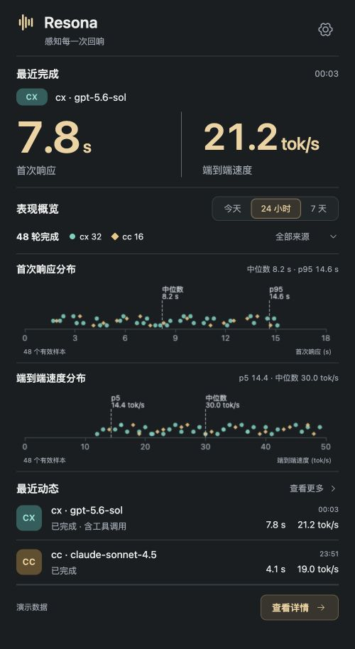

# Resona · 回响

**English** | [简体中文](README.zh-CN.md)

[](https://github.com/xuzhu-591/resona/actions/workflows/ci.yml)

**Feel the rhythm of your AI conversations.**

Resona is a local-first macOS menu bar app for understanding Codex and Claude Code response performance. It reads existing session logs, makes no model requests, and does not need an API key.

[Contributing](CONTRIBUTING.md) · [Changelog](CHANGELOG.md)



## What it shows

- Latest completed turn: time to first token (TTFT) and end-to-end output speed.
- Shared time and provider filters, response trends, two distributions, and per-model percentiles.
- Searchable turn history with identifiers, metric evidence, and missing-data explanations.
- Codex active **and archived** sessions, including multiple rollouts belonging to one thread.
- Claude Code main sessions; identified subagents are excluded from main-interaction statistics.
- Menu bar display preferences, system/dark/light appearance, login launch, and local source settings.

TTFT uses the source tool's native metric where available, otherwise a clearly identified assistant-event estimate. Speed is output tokens divided by the **whole turn duration**, including waiting and tools. Missing or unverifiable values are `N/A`, never a fabricated zero. Imported legacy rows remain visible but do not enter trusted aggregates until reparsed.

## Install

Signed public downloads are pending Apple Developer ID and notarization setup. You can build and run the app locally now using the instructions below.

Targets macOS 13 or later. When signed downloads are available, [Releases](https://github.com/xuzhu-591/resona/releases) will provide separate Apple Silicon (`aarch64`) and Intel (`x64`) builds. For a local source build, drag the generated `Resona.app` into Applications, then open it. Closing a window keeps collection running in the menu bar; use **Quit Resona** to stop it.

Release notes state the signing/notarization and tested-platform status of each artifact. Source builds and development artifacts do not carry a production Developer ID signature.

## Quick start

1. Left-click the menu bar item to open the compact performance panel; click again or press Escape to dismiss it. Right-click for the app menu.
2. Choose Today, 24 hours, or 7 days to update both distributions together.
3. Open **View details** to carry those filters into the overview, or **View more** for turn history.
4. In **Settings → Data sources**, choose your Codex home or Claude projects directory if you use a custom location. Codex active and archived directories are tracked together.

The first history scan is incremental; source errors are shown without blocking other readable files.

## Data stays local

| Data | Location |
| --- | --- |
| Resona database and settings | `~/.resona/monitor.sqlite3` (fixed, not configurable) |
| Codex active sessions | `<Codex home>/sessions/` |
| Codex archived sessions | `<Codex home>/archived_sessions/` |
| Claude Code sessions | `~/.claude/projects/` by default |

Resona never modifies source logs. It stores metric facts and local file checkpoints, not prompts, reasoning text, commands, or tool output. Disabling a source pauses future collection and preserves history. There is no telemetry or cloud synchronization.

## Build from source

Install Xcode Command Line Tools, Rust (rustup), Node.js and pnpm. Versions are pinned in `rust-toolchain.toml`, `.node-version`, and `package.json`.

```bash
git clone https://github.com/xuzhu-591/resona.git
cd resona
pnpm install --frozen-lockfile
pnpm dev
```

```bash
pnpm check
pnpm check:desktop    # macOS only
pnpm build           # local ad-hoc-signed app and DMG
```

The core crate can be tested on Linux without WebView dependencies:

```bash
cargo test -p resona-core --locked
```

`pnpm dev:web` runs an explicitly labelled demo with synthetic data for UI work. `pnpm dev` runs the real desktop app and uses the fixed local database. Apple publishing credentials are not required to contribute or build locally.

## Compatibility

Source log formats are version-dependent. Unresolved identities, missing inherited prefixes, contradictory facts, and unverifiable token counters remain visible with quality information. They are not silently converted into trusted samples. Reverting a conversation does not erase latency already experienced: actual turns on discarded branches remain in the historical statistics.

Resona is an independent community project, not an official OpenAI or Anthropic product.

## License

[MIT](LICENSE), copyright © 2026 Xu Zhu. Third-party dependencies retain their own licenses.
