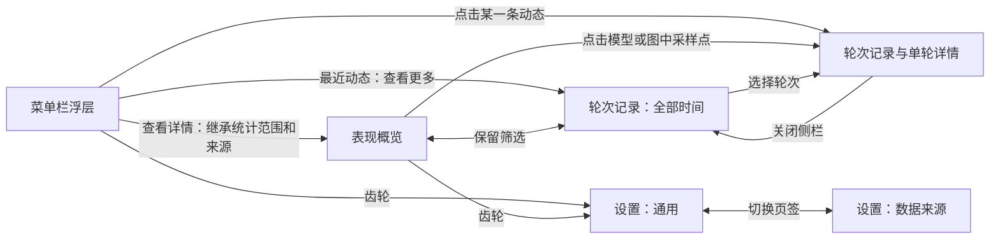

# Resona 页面与交互方案

日期：2026-09-20。阶段：产品设计已确认，完整技术方案待评审，见[技术方案](technical-design.md)。视觉沿用已选定的深石墨底、暖金读数、青绿/暖金来源标识。本轮补齐独立详情窗口、单轮查看和设置的主流程，未实现可点击应用。

## 1. 页面导航

“查看详情”打开或聚焦同一个独立窗口，不重复创建窗口。浮层收起后详情窗口仍存在；关闭详情或设置窗口后应用继续驻留菜单栏。退出应用才停止本应用采集。

| 入口 | 打开位置 | 初始筛选 |
| --- | --- | --- |
| 浮层底部查看详情 | 表现概览 | 继承浮层统计区域的范围与来源，模型为全部 |
| 浮层最近动态查看更多 | 轮次记录 | 全部时间、全部来源、全部模型、全部状态，按最新完成优先 |
| 浮层某一轮动态 | 轮次记录与单轮侧栏 | 全局记录列表，定位并选中该轮 |
| 概览切换轮次记录页签 | 轮次记录 | 保留范围、来源和模型 |
| 概览点击某个模型 | 轮次记录 | 保留时间和来源，追加该模型筛选 |
| 概览点击趋势采样点 | 轮次记录与单轮侧栏 | 保留当前筛选，定位该轮 |
| 任何齿轮入口 | 设置 | 首次进入通用；当前运行期间返回上次设置页签 |

“查看更多”打开全局记录与“查看详情”继承统计筛选分别服务两个任务，标题和筛选控件始终显示实际范围。图片中的轮次记录页展示从今天概览切换进入的示例，因此选中今天。

## 2. 表现概览

原型：[表现概览](prototypes/05-details-overview.png)。

窗口以约 1200 × 860 逻辑尺寸探索，可调整大小；较小窗口允许内容滚动。顶部采用表现概览/轮次记录两个页签，不增加管理后台式侧栏。

### 筛选与概况

时间范围提供今天、24 小时、7 天、自定义。自定义通过日期范围选择器选择开始日和结束日，使用本地时区；结束日在今天时截止当前时刻，历史结束日覆盖完整自然日，禁止未来时间与开始晚于结束。页面清楚展示完整所选日期。

来源和模型是独立筛选。来源改变后模型选项随之调整；已选模型不属于新来源时重置为全部模型。范围与筛选统一作用于完成轮数、趋势、双分布与模型表现。切换时以同一个查询快照更新全部区域。

顶部仅保留完成轮数、首次响应中位数、速度中位数和来源计数的轻量概况，不另造一排重复指标卡片。

### 响应趋势

主视觉为按完成时间排列的趋势图，通过首次响应/端到端速度切换纵轴指标。横轴始终是真实时间；只绘制截止时间内的数据，长空档保留并标明无请求，不跨长空档连线。

来源同时使用颜色和形状区分。悬停显示完成时间、来源、模型、对应指标；点击样本进入单轮详情。长时间范围采用保留统计意义的时间桶表达：明确标注桶范围、有效轮数、中位数和较慢端分位数，桶的点击进入其范围内轮次列表，不能把聚合桶伪装为单轮。原始样本用于最终统计，不能平均各桶分位数作为总分位数。

### 双分布与模型表现

详情窗口空间允许双分布并排：首次响应显示 p50/p95，速度显示 p5/p50，分别标明单位和有效样本数。它们与浮层使用同一指标口径。

模型表现按来源+模型分组，显示轮数、首次响应 p50/p95、速度 p50/p5。每组计算使用该组原始有效样本；不输出综合健康分、自动选模结论或模型优劣排名。点击一组查看该组实际轮次。

## 3. 轮次记录与单轮详情

原型：[轮次记录与单轮侧栏](prototypes/06-round-detail.png)。

### 列表

| 控件 | 功能 |
| --- | --- |
| 时间范围 | 今天、24 小时、7 天、自定义、全部时间 |
| 来源/模型 | 过滤实际轮次 |
| 状态 | 全部、已完成、已中止；进行中的任务留在浮层活动状态，不冒充完成记录 |
| 搜索 | 搜索会话 ID 或轮次 ID；不搜索未采集的正文或任务标题 |
| 排序 | 最近完成优先、首次响应最久、端到端速度最低 |
| 分页 | 默认每页 20 条，保留筛选与排序；图中 6 条为静态空间示例 |
| 行选择 | 打开右侧单轮详情；列表位置和筛选保持不变 |

N/A 始终排在有效数值后，中止轮次的性能指标不参与分位数。状态计数在时间、来源、模型及 ID 搜索过滤后、应用状态选择前计算。概览只统计完成轮次，因此演示中的 48 轮完成与列表的 50 条记录（48 完成、2 中止）不矛盾。

列表沿用浮层最近动态的来源标识、模型、时间和双指标结构。页面允许必要的列标题与排序，但不加入任务摘要或对话正文。

### 单轮侧栏

| 内容 | 表达 |
| --- | --- |
| 来源、模型、状态 | 清楚显示来自哪个工具、是否完成、是否观察到工具调用 |
| 首次响应、端到端速度 | 主要读数，缺失项 N/A |
| 开始与完成时间 | 本地日期和时分秒，跨日不省略日期 |
| 总耗时 | 使用指标计算所依据的总耗时，不自行换一个分母 |
| 输出 token | 原始有效输出量，缺失为 N/A |
| 会话 ID、轮次 ID | 屏幕可截断，复制按钮复制完整值并短暂提示已复制 |
| 指标说明 | 展开解释 TTFT 口径及 TPS 包含等待、思考和工具过程 |

固定演示轮次：2026-09-20 14:30:00 开始，14:32:00 完成，总耗时 120 秒，输出 2,544 token，端到端速度 21.2 tok/s，首次响应 7.8 秒。

已核对旧项目数据类型：当前完成记录没有持久化详细事件时间线、工具调用耗时分解或逐轮 TTFT 取值来源。因此侧栏不展示服务排队、网络、模型思考、工具执行耗时等分段，也不把记录标为某一种 TTFT 取值来源。可解释通用取值规则；未来若需要逐轮来源，必须先设计采集与持久化契约。

关闭侧栏回到原列表位置；窄窗口将侧栏改为单轮子页，返回时保留列表状态。

## 4. 设置：通用

原型：[通用设置](prototypes/07-settings-general.png)。

设置窗口使用通用/数据来源两个页签，沿用深色风格。配置即时生效并保存，不放重复的全局保存按钮；保存失败时恢复原值并显示具体失败原因。

| 设置 | 可选值 | 默认/行为 |
| --- | --- | --- |
| 登录时启动 | 开/关 | 默认关，用户打开后通过 macOS 登录项能力注册；系统拒绝或关闭时显示真实状态 |
| 菜单栏指标 | 首次响应、端到端速度、两项都显示 | 默认首次响应；原型展示用户选择两项都显示后的预览 |
| 显示来源 | 开/关 | 默认开，显示 cx/cc |
| 显示模型 | 开/关 | 默认关，开启后显示最近完成轮次的模型，长名称按菜单栏可用宽度截断 |
| 外观 | 跟随系统、深色、浅色 | 默认跟随系统；本轮以深色选中状态评审。浅色视觉适配属于后续主题工作 |
| 默认统计范围 | 今天、24 小时、7 天 | 默认今天；无入口带入的筛选时使用 |

菜单栏有实时示例预览，调整显示项后同步变化。无最近完成轮次时显示等待完成，不能拿演示值填入正式菜单栏。

关闭窗口后继续驻留是固定产品行为，以说明文字表达，不做一个含义矛盾的设置开关。当前运行期间窗口各自保留最近筛选；应用重新启动时使用配置的默认范围。从浮层带入的范围优先于默认设置。

首版不暴露刷新间隔、阈值告警、API Key、费用、清理策略和底层数据库参数。

## 5. 设置：数据来源

原型：[数据来源设置](prototypes/08-settings-sources.png)。

| 来源 | 默认日志目录 | 设置与操作 |
| --- | --- | --- |
| Codex | home 默认 `~/.codex`，实际进程设置 CODEX_HOME 时优先使用 | 统一采集开关、选择 home、打开目录、检查读取；自动派生 `sessions/` 与 `archived_sessions/`，分别展示读取状态 |
| Claude Code | `~/.claude/projects` | 采集开关、选择目录、打开目录、检查读取 |

开关只控制 Resona 对该来源的新增采集，不修改源工具配置，不删除已统计的历史记录。关闭后保留读取偏移，再开启时补采期间新增的完整日志。首次发现目录后自动读取；不存在的来源显示未发现，并支持选择自定义目录，不阻断其他来源。

Codex 的活跃与归档目录同等进入统计，移动或恢复归档不增加轮次，同一个 thread 的多个 rollout 按实际轮次去重。

“选择目录”使用系统目录选择器。Codex 选择 home 并成对切换两个派生目录，不单独配置归档目录。用户选中后先验证目录可访问；失败保留原配置并显示原因。可访问但没有日志的目录可保存，状态为未发现日志。新目录成功启用后保留旧目录已有历史记录，依靠稳定来源/轮次标识去重，不因目录变更清空历史。

“检查读取”立即检查来源访问状态并触发一次增量读取；不重新扫描回放全部历史，不产生模型请求。“可读取”只表示本地采集状态，与模型服务健康无关。更改后失败状态不得仍显示保存成功。

本地统计数据固定存放在 home 下隐藏目录 `~/.resona/`，数据库为 `monitor.sqlite3`。设置页仅展示路径和打开入口，不支持修改存储位置。原型图 08 中旧存储路径与 Codex 单目录文案以本节为准。本阶段没有创建运行时数据库或迁移旧数据，具体迁移规则见[技术方案](technical-design.md)。首版不提供删除全部历史或强制重建按钮。

## 6. 异常、空状态与反馈

本轮四张图覆盖主要正常使用页面，以下状态以规格定义，尚未逐张绘制；交互原型阶段补齐。

| 场景 | 画面和动作 |
| --- | --- |
| 详情范围无数据 | 保留筛选，图形改为空状态；提示改变范围或清除筛选，不补零分位数 |
| 列表搜索无结果 | 展示实际查询条件与清除搜索动作，分页归零但不伪造记录 |
| 某指标不可计算 | 对应 N/A，另一指标正常显示；侧栏可查看缺失说明 |
| 切换统计范围 | 旧快照保持可读并显示更新中，成功后各区域一起替换 |
| 新轮次到达但用户在读列表 | 更新计数并提示有新记录，用户点击后刷新列表，不抢走选择与滚动位置 |
| 已选轮次被后续数据更新 | 原位更新当前轮次；不跳到最新轮次 |
| 目录不存在 | 未发现目录、选择目录；保留其他来源和历史结果 |
| 目录不可读 | 具体读取失败原因、重新检查、选择其他目录 |
| 来源已关闭 | 已暂停；可继续查看历史；重新打开补采 |
| 登录项设置失败 | 显示未启用并说明系统返回的原因，不伪装为已开启 |
| 复制 ID | 复制完整 ID，短暂显示已复制 |
| 退出应用 | 终止本应用采集，下次启动补采；窗口关闭不等于退出 |

## 7. 契约变更与影响

| 契约 | 本次原型阶段 | 实现阶段约束 |
| --- | --- | --- |
| 外部接口 | 无变化，无线上接口 | 桌面命令/事件与窗口导航契约在技术方案定义 |
| 算法和协议 | 原公式无变化，补全范围、排序、分页、分布和详情表达 | 按原始样本计算；不引入缺乏来源证据的耗时分解 |
| 数据库结构 | 无变化 | 本次文档交付不执行 DDL；新库完整 DDL 已列于技术方案 |
| 持久化数据 | 无变化，本次仅更新文档与图片 | 设置需持久化于固定隐藏目录；来源开关/目录变更保留历史，旧库只读导入及重算规则见技术方案 |

## 8. 上线步骤

本次只交付静态原型与规格，不安装、部署或变更用户采集。

1. 发布前检查：原型名称、单位、有效样本口径、单轮数值和页面导航一致。
2. 部署顺序：本阶段不适用；后续先交互原型验收，再接入实际采集与打包。
3. 数据重算/backfill：本阶段不适用；关闭来源后重新启用的增量补采在实现阶段验证。
4. 固定 Case：浮层带入筛选、全局查看更多、模型筛选、点选轮次、N/A、时间范围切换、目录更换失败、来源暂停恢复、登录项失败。
5. 恢复自动任务：本阶段不适用；未启动或暂停真实采集。
6. 观测与回滚：本阶段只有可回退的设计文件；后续观察查询耗时、空闲占用与采集新鲜度，再确定应用回滚入口。

## 附录：静态原型检查

四张图片均已逐张查看，主要内容与入口已呈现，单轮示例 2,544 / 120 = 21.2 tok/s 一致；未出现对话正文或虚构的分段耗时。后续交互原型需统一概览与记录页的页签组件，移除记录页与“最近完成优先”不一致的首次响应列降序箭头，并按实际每页条数计算分页。

概览中的分布点位、刻度与分位线仍为生成图示意，不能作为统计计算验收证据。通用设置图展示登录时启动已开启、两项指标已选中等用户配置后的状态，不代表默认值；默认值以本规格为准。

当前交付只补齐正常主流程的页面视觉，尚未生成各异常状态截图、浅色主题或可点击界面。
