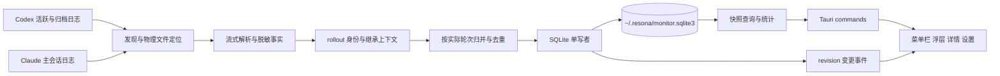
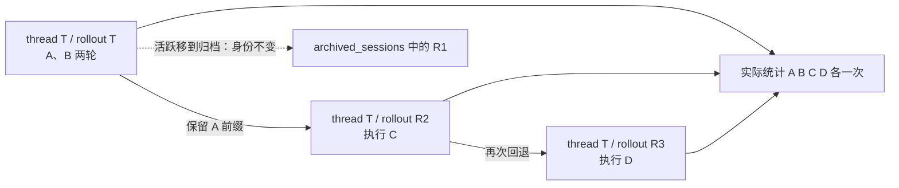
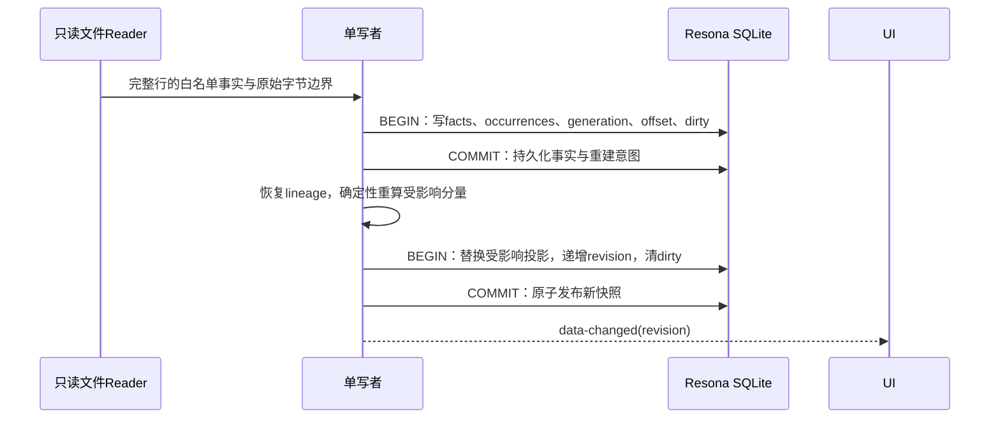

# Resona · 回响 完整技术方案

日期：2026-09-20。状态：待技术评审，产品视觉与主流程已确认。本次仅编写方案、同步产品文档并验证 DDL，不开始应用开发，不改源工具日志或现有统计库。项目按公开开源仓库交付；开源规范、CI 与发布设计见第 14 节。

## 1. 目标与关键决策

Resona 是独立 macOS 菜单栏应用，使用 **Tauri 2 + React / TypeScript + Rust + SQLite**。复用旧项目的指标定义、脱敏测试思路和源格式经验，将采集核心迁移至 Rust；不内嵌 Node 辅助进程，不依赖 SwiftBar。

| 决策 | 最终约定 |
| --- | --- |
| 本地持久化根目录 | 固定 `~/.resona/`，由系统用户 home API 获取；界面只读显示并提供打开，不提供配置项 |
| Codex 扫描范围 | 同时扫描 Codex home 下的 `sessions/`、`archived_sessions/`；两者同等进入统计 |
| 文件格式 | Codex 支持 `.jsonl` 与 `.jsonl.zst`；Claude 支持 `.jsonl` |
| 多 rollout | thread、rollout、物理文件、实际轮次分别建模；一条 thread 可有多个 rollout，每个 rollout 可有多个物理表示 |
| 统计口径 | 统计实际发生的轮次；回退、归档、恢复不抹去已经发生的响应 |
| 重复控制 | 物理位置幂等、rollout 事件幂等、实际轮次幂等、token 使用量幂等四层分别处理 |
| 当前历史入口 | 不用“最新文件”选择历史；首版也不需要依赖 Codex state SQLite 的 current 指针 |
| 子代理 | 第一版默认仅主交互线程；明确标识的 Codex/Claude 子代理不进入用户轮次统计 |
| 存储迁移 | 新库、新 schema；旧库只读导入，不原地 ALTER，不复用旧文件偏移 |
| UI | 采用已确认深色原型；双分布、可切换范围、详情和设置按页面方案实现 |
| 开源与分发 | MIT；GitHub 公开仓库与 Releases；macOS arm64/x64 签名公证 DMG，首版不发布 crates.io/npm 包 |
| 工程质量 | 参考 Grove 的 core/宿主分层、fmt/Clippy/test/audit 与 tag 发布；补齐前端检查、版本一致性及桌面制品验证 |
| 开发顺序 | 先实现采集与统计契约及测试，再接 UI 和系统托盘，最后安装验收与切换 |

“统计实际发生”举例：R1 发生 A、B 两轮，回退到 A 之前生成 R2，再执行 C。Resona 仍统计 A、B、C 各一次，因为等待已经真实发生；不会把 R1 的 A/B 沿 history_base 再导入一遍。它不试图还原当前送给模型的完整对话正文。

产品入口与交互见 [页面与交互方案](pages-and-interactions.md)，视觉见 [产品方案](product-plan.md)。

## 2. 已核对事实与兼容边界

### 2.1 源码与本机证据

核对的 Codex 本地源码提交为 `b0af519c39`；仅代表本次检查的版本，不把 alpha 日志协议视为永远稳定的公共 API。

| 已确认事实 | 依据与实现影响 |
| --- | --- |
| 普通 rollout 的 rollout ID 等于 thread ID；回退文件另带 rollout ID | `rollout_file_name.rs` 明确解析 `threadId_rolloutId` |
| `session_meta.id` 为稳定 thread ID | `protocol.rs::SessionMeta`；不能用新增 `session_id` 替代它，后者在新协议中指根 session |
| `history_base.thread_id` 实际指 rollout ID | `HistoryPosition` 注释明确此历史命名；字节位置针对解压后原始 JSONL |
| 回退创建新文件，旧文件保持 | `thread-store/.../revert_thread.rs`；current pointer 的切换不等于实际轮次删除 |
| 归档会移动 thread 所有相关 rollout | `archive_thread.rs` 枚举 owned rollout 后 rename；不能只盯某一个原路径 |
| paginated ordinal 从继承边界继续 | `rollout/src/ordinal.rs`；不同分支可复用相同 ordinal，所以 ordinal 必须带 rollout 身份 |
| 新源码支持 zstd 冷日志 | `rollout/src/compression.rs`；压缩与解压可能替换物理路径 |
| 新日志使用 `item_completed` 等事件 | 本机样本出现 AgentMessage、Reasoning、CommandExecution、FileChange、McpToolCall |
| `token_count` 可能因额度更新重发 | `session/mod.rs::update_rate_limits` 调用 `send_token_count_event`，不能逐条盲加 last usage |
| 新协议提供 `token_usage_record` | 带 thread_id、turn_id、response_id、turn_token_usage，优先使用明确归属的计数 |
| 当前旧插件只扫 Codex 活跃目录 | `src/cli/main.ts` 默认 `~/.codex/sessions` |
| 旧插件会错误识别多 rollout 文件的 thread ID | `storage/database.ts::codexSessionId` 只取文件名最后一个 UUID |

2026-09-20 的只读日志检查确认：活跃和归档目录均有历史数据，同一 thread 可以存在多个 rollout；抽样元数据包含稳定 thread ID、独立 rollout ID 与 history_base 引用。样本日志版本为 `0.154.0-alpha.6.2`，未观察到 zstd 实例，压缩支持来自源码证据。该检查不代表跨版本完整性验证；公开资料仅保留格式结论，不附个人会话清单或真实日志，测试素材使用人工构造数据。

OpenAI [App Server 官方文档](https://developers.openai.com/codex/app-server)确认 archive/unarchive 的目录移动语义；本地字段和字节边界细节以本次源码检查为依据。Resona 不启动 App Server，不发模型请求。

### 2.2 本轮不扩展的能力

不统计额度或费用，不生成服务健康分，不拆分网络/排队/思考/工具耗时，不展示对话正文。不读取 Codex state 数据库来推断当前有效历史；源数据库临时不可访问不应阻塞日志采集。不支持远端机器或云端没有落盘的会话。

无法确定归属或计数的记录进入诊断与 N/A，不靠文件 mtime、最大文件或时间接近程度猜成有效指标。

## 3. 技术栈与工程结构

| 层 | 技术 | 职责 |
| --- | --- | --- |
| 桌面宿主 | Tauri 2，Rust stable | 生命周期、单实例、托盘、窗口、设置、采集 |
| 前端 | React 19、TypeScript 5、Vite | 浮层、详情、列表、设置 |
| 组件 | Radix 交互原语 + 自定义 CSS tokens | 焦点、菜单、分段控件、深浅主题；不套后台模板 |
| 图表 | Apache ECharts，Canvas renderer | 趋势、双分布、hover/click；语义列表提供无图表阅读路径 |
| UI 状态 | React 状态 + 小型 store；TanStack Query | 页面筛选、查询取消、缓存和新数据提示 |
| SQLite | rusqlite bundled + SQLite Backup API | 同一内嵌 SQLite 版本、单写者、事务与迁移 |
| 文件发现 | notify（macOS FSEvents）+ 定时补扫 | 追加、创建、移动、压缩替换 |
| 解压 | zstd 流式 reader | 解压读，不在源目录展开文件 |
| 异步/后台 | Tokio + 受限 blocking worker | 事件调度、读取/解析、SQL 计算 |
| 序列化 | serde + ts-rs | allowlist 解析 DTO 与前端类型生成 |
| 系统插件 | single-instance、positioner、autostart、dialog、opener、clipboard-manager | 最小需要的桌面能力 |

最低部署目标 macOS 13；首个正式 Release 提供 Apple Silicon 与 Intel 两套经过验证的安装包。具体补丁版本在初始化时锁定 `Cargo.lock`、`pnpm-lock.yaml`、`rust-toolchain.toml`，不使用运行时拉取依赖。开发机安装 Node LTS、pnpm、Rust stable、Xcode Command Line Tools；用户只安装 .app。公开安装包的签名、公证、版本与分发流程见第 14 节；GUI 源码构建无需 Apple 开发者付费账号。

建议结构：

```text
resona/
  Cargo.toml / Cargo.lock        workspace，唯一 Rust 锁文件
  package.json / pnpm-lock.yaml  前端与统一开发命令，private=true
  rust-toolchain.toml / .node-version
  LICENSE / README.md / CHANGELOG.md / CONTRIBUTING.md / SECURITY.md
  .github/workflows/            ci.yml / release.yml / dependencies.yml
  .github/dependabot.yml        Cargo/npm/Actions 更新
  .github/ISSUE_TEMPLATE/        Bug、功能建议
  .github/pull_request_template.md
  deny.toml / eslint.config.js / .prettierrc
  docs/                         中文使用说明、产品、技术、发布说明、原型
  crates/resona-core/
    src/{discovery,adapters,identity,reducer,metrics,storage}/
  src/
    app/                        窗口路由、主题、导航
    features/{popover,overview,turns,settings}/
    components/                 通用交互与图表
    api/                        生成类型、invoke 封装
  src-tauri/
    src/{commands,windows,settings}/
    migrations/
    capabilities/
  scripts/                      检查入口、版本同步、发布验证
  tests/fixtures/               人工构造的脱敏 JSONL/zstd/旧库
```

当前新目录尚未初始化 Git，也不存在保护分支代码改动。本阶段只写 docs。开发开始时建立仓库与工作分支；后续 worktree 操作按用户规范使用 grove，保护分支不直接改代码。

workspace members 为 `crates/resona-core` 与 `src-tauri`；core 不依赖 Tauri/WebView，能在 Linux 和 macOS 单独测试，桌面宿主只在 macOS 构建。沿用 Grove 的 Rust edition 2021，MSRV 以初始化时选定依赖的实际最低要求写入 `workspace.package.rust-version`，固定工具链不得低于它。两个 crate 继承工作区版本、MIT 许可和 lint 配置，并设置 `publish=false`。

## 4. 运行架构与数据流



- 只有 Rust 可以访问日志与统计数据库；前端只拿 DTO。禁用前端任意文件访问和任意 shell 执行能力。
- 一个后台写线程串行读取、解析和维护 SQLite；每文件每批最多 1,000 行，每 tick 最多 24 个文件或约 180ms 读取预算。长文件剩余批次进入续读队列。重算按受影响的 thread/base/共享 turn 依赖分量进行，SQL 查询先去重 turn ID，避免事件交叉匹配放大。
- 事实、occurrence、文件偏移和 durable dirty 标记在同一事务提交；轮次投影与 data_revision 在第二个事务发布。任何已推进偏移都对应可重放事实与未完成意图；启动先恢复 dirty 分量。UI 只读取完整发布的投影 revision。
- 查询使用独立只读连接（最多 2 个）与短读事务。一次概览命令内读取同一 revision 与截止时间，避免两图数值来自不同快照。
- WAL 用于 Resona 自己的库；源文件只读。退出时停止调度、完成当前小事务、关闭连接；不强行修改源工具进程。

### 4.1 固定本地目录

```text
~/.resona/
  monitor.sqlite3
  monitor.sqlite3-wal           SQLite 运行时文件
  monitor.sqlite3-shm
  instance.lock                补充写锁
  logs/                        仅本应用脱敏诊断，轮转
  backups/                     schema 升级前的 SQLite 一致性备份
  staging/                     导入/重建临时库，完成后移除
```

设置也存 app_settings/source_roots，不单独增加可配置数据目录。源日志目录可以选择；这是输入位置，与固定输出位置分开。禁止提供 `dataDir`、`dbPath` 设置或发行版环境变量覆盖。测试通过构造参数注入临时目录，不动用户 home。WebKit/系统自行管理的缓存不属于统计存储目录。

设置页显示 `~/.resona/` 与“打开”，不出现选择按钮。旧原型图中的 Application Support 路径仅为已失效文案，以本方案为准。

### 4.2 发现、增量与补扫

| 场景 | 行为 |
| --- | --- |
| 首次启动 | 优先发现近期活跃文件，同时分批补全两类 Codex 根目录和 Claude 根目录；直到所有可读候选完成，显示“历史整理中，统计尚不完整” |
| 正常追加 | FSEvents 合并唤醒，后台 tick 消费通知；读取到最后一个完整 LF，不推进半行尾部 |
| 通知丢失 | 5 秒检查近期变化/有 pending 的文件；60 秒重新遍历目录发现新文件与移动，归档目录同样补扫 |
| 文件移动 | 新路径重新读取并按规范 rollout ID/语义事实去重，device+inode 用于检测同路径替换；旧路径消失不删除历史 |
| 重新出现 | 核对已提交边界的 prefix/checkpoint 指纹，匹配才复用偏移 |
| 截断、同路径重建 | 新 generation，从头重新读；不先清空已发布轮次，待候选重建后替换 |
| zstd | 流式解压，偏移针对解压后的原始字节。冷文件无变化跳过；变化后从压缩流头解码到检查点，不将压缩字节位置当 JSONL offset |
| plain/zstd 并存 | 分别只读解析两种表示并核对语义事实；相同事件只入库一次。分歧保留证据并标记 conflict，不选择“更大的那个” |
| 休眠恢复 | 立即补扫并恢复被合并的事件；不假装睡眠期间实时采集 |
| 单文件错误 | 记录文件级失败，其他文件继续；目录一轮遍历结束不等于全部采集成功 |
| 超大 JSONL 行 | 流式丢弃不需要的大文本；实现仍需上限（默认单行 16MiB）；超限跳到 LF 并标记该片段不完整，不记作成功解析 |
| 文件内容被改写且不在采样指纹覆盖区 | 已成功检查超过一天的文件切换新 generation 完整重读；首次导入与表示切换同样完整解码校验。事件流本身按追加式协议处理，不宣称瞬时检测任意原地篡改 |

调度维护根状态、每个文件成功位置、mtime/inode/指纹、generation 与失败状态；未发现的可选来源是 missing，不是全局故障。首次初始化完成的判定包含“本轮候选文件均成功或明确被排除”，不把读失败当已覆盖。

## 5. 身份模型与多 rollout 算法

### 5.1 四层身份

| 对象 | 唯一身份 | 不使用的替代品 |
| --- | --- | --- |
| thread | Codex `session_meta.id`；Claude sessionId | 不用根 session_id、文件名最后一个 UUID |
| rollout | `(provider, rollout_id)`；Codex 正规文件名解析 | 不用 thread ID 一刀切多个分支，不用绝对路径 |
| 物理表示 | file_id + generation；记录 path/device/inode/encoding | 不把移动或压缩生成新样本 |
| 实际轮次 | `(provider, turn_key)` | 不按文件、ordinal 或显示模型生成轮次 ID |

Codex turn_key=`turn:<native_turn_id>`。相同原生 turn ID 的复制历史只对应一个实际轮次；真正再次执行应有新的 turn ID。若相同原生 ID 出现互不兼容的开始时间、所有者或终态，而且不能由明确继承关系解释，标记身份冲突，不擅自合并数值，也不改造两个虚构轮次。

Claude turn_key=`session:<session_id>:user:<user_uuid>`，对应主会话真实用户消息；同一消息在复制文件中出现不增加轮次。provider 参与主键，因此两种来源的相同字符串不会碰撞。

Codex session_meta.id 优先；只有字段缺失时才按完整规范文件名回退。两者都有且不一致是 conflict。普通文件 rollout ID=thread ID；下划线之后只作为 rollout ID。未知格式进入 unresolved 目录诊断，不导入有效样本。

`root_session_id`、`parent_thread_id`、`forked_from_id` 单独存。新协议多个子 thread 可能共用根 session_id，不能按它合并 thread。明确子代理通过 source/thread_source/parent 与 subagent 标识排除；旧版没有这些标识时保留 unknown，不能根据目录或昵称猜测。unknown 记录保留在记录/诊断中，但在主交互统计中先排除，直到归属可确认；不能为了看起来完整而把潜在子代理并入主统计。

### 5.2 事件位置与语义幂等

1. 有 ordinal：event_key=`ordinal:<n>`，作用域必须是 provider+rollout_id。
2. 无 ordinal：event_key=`byte:<decoded_line_start>`，作用域同上；不使用“第几条有效事件”，因为未知行也占位置。
3. variant_hash 对 allowlist 规范化事实（包含事件时间、ID、必要数值）做哈希。相同位置相同事实只新增物理 occurrence；同位置不同事实标 conflict，不能 last-write-wins。
4. 多个不同 rollout 可以有相同 ordinal；先独立保存，再按原生 turn/item/response 身份做语义归并。
5. 内容投影哈希不是 token 请求 ID；两个合法响应即使输出量相同，也不能只按数值或事件文本哈希去重。
6. 源版本重解析使用新的 parser_version 与 occurrence generation；比较冲突只在相同 parser_version 内进行，不能把解析器升级误判成源分歧。

### 5.3 history_base 的使用范围

引用前缀用于恢复“新文件开头已有的上下文”：当前 open turn、对应 model、token 计数基线、明确所有者。它不是把父文件轮次再记账一次的指令。

处理步骤：

1. 将 base_rollout_id 解析到本地 rollout 索引，索引覆盖活跃、归档和压缩表示。
2. 验证 end_byte_offset 是解码后完整 JSONL 边界，并与 end_ordinal_exclusive 对应；使用原始字节，不能先 trim 或归一化换行。
3. 仅用该前缀中的脱敏事实重建继承游标；沿 base 递归时检测循环，最多 128 层（超限是诊断，不能截断冒充完整）。
4. 子文件里的新增事实在其本地 rollout 下处理；从父前缀恢复的旧事实保留原 origin，不新增轮次或 token。
5. 父文件晚到后，将依赖子 rollout 标 dirty 并重建。缺少基线时，已有终态原生 TTFT 可独立显示，但无法确认的输出量/TPS 为 N/A。
6. 父文件在回退边界之后真实执行过的终态轮次仍通过它自身文件进入历史统计，不能因不在当前链内而删除。
7. 不以线程 current pointer 决定采集范围，因此无需打开 `state_5.sqlite`；是否“当前有效对话成员”也不作为本产品字段。

### 5.4 跨文件 Turn、复制历史与 Fork

- 开始和结束在不同 rollout：相同原生 turn ID，并且 lineage 或明确 owner 字段确认归属时，合并为一轮；无 turn ID 的 token 只能绑定该物理流已明确的 open turn，不能全 thread 取“最近开始”。
- 两个分支同时读：每个 rollout 有自己的 reducer 游标，不能共享 latest pending 或 token 基线。
- 新协议 event/item/token_usage_record 中的 thread_id 表示明确 owner，复制后不改归属。
- 对 copied fork，优先使用 forked_from_ordinal、subagent_history_start_ordinal 或明确 owner 划分继承前缀；legacy 无边界时与父流的有序事实前缀比对。不能只用时间小于文件创建时间推断继承。
- 父日志缺失且无明确 owner/边界的 copied 历史不计入新 thread，标 unresolved；本地明确属于新 thread 的轮次可以正常计入。
- 同一原生 turn 出现在多个 thread 文件中仍只算一次；owner 无法确定则显示 N/A/诊断，不能“先扫到哪个就归哪个”。
- 文件遍历顺序不得改变最终轮数、所有者或 token。需要合并更多证据时重放该 turn 的事实投影，不直接反复执行累加器。

### 5.5 固定示例



同一个 T 有 3 个 rollout、4 个实际执行轮次。旧文件尾部被 current history 排除、文件归档或压缩，都不改变这个实际发生数。

## 6. 源适配与指标计算

### 6.1 Codex 适配器

按字段存在与类型选择解析能力，不只比较 cli_version 字符串。兼容 legacy/paginated 两种布局。

| 输入 | 提取内容与规则 |
| --- | --- |
| session_meta | 身份、版本、继承边界、主/子类型；不保存 instructions/cwd 正文 |
| task_started | 原生 turn ID、root_turn_id、开始时间；root_turn_id 不替代原生 turn ID |
| turn_context / thread_settings_applied | 优先 turn 级模型；线程设置仅用于该 rollout 对应时点的后备模型 |
| agent_reasoning / agent_message | legacy 首个可观察助手事件时间，仅在原生 TTFT 缺失时回退 |
| item_started / item_completed | 按明确 thread/turn/item ID 识别助手与工具类型。只有完成事件时不把整条完成时间冒充首 token 时间 |
| token_usage_record | 明确 turn/response 计数，优先于旧 token_count |
| token_count | 旧版累计快照，使用计数差与重复快照去重 |
| response_item 的工具类型 | function_call/custom_tool_call 等已知调用类型，仅提取工具标记和 ID |
| task_complete | 成功终态及原生时间；error 非空时是失败，不算成功完成 |
| turn_aborted | 中止终态，不进入 TTFT/TPS 分位数 |
| 未知事件 | 可跳过非指标事件；如果造成边界/计数缺口，明确质量状态，不默默补齐 |

TTFT：有效原生 time_to_first_token_ms 优先；其次仅使用适配器已确认的首个助手活动事件；仍缺失则 N/A。记录 ttft_source，UI 可解释为原生/事件估算/未知，不宣称网络 TTFB。

时间戳处理：原生 started_at/completed_at 的单位是秒；JSONL timestamp 为带时区时间。开始优先完整 task_started 行时间（ms）并核对原生字段，完成优先 task_complete 行时间；缺少行时间才回退原生秒字段。duration_ms 优先有效原生值，其次开始/完成差值。原生秒精度与行落盘延迟可能使显示起止差和 duration 略有差别，UI 保留指标依据，不强改分母。负值或矛盾值记为 N/A/质量异常。

### 6.2 Token 去重与计数优先级

同一轮每次重算只能选择一种已确认来源，不能把三种口径相加。

1. **turn_usage**：新版 token_usage_record 的 turn_token_usage.output_tokens。按原生 turn 归属，对 response_id 去重，使用该轮已确认最后响应的累计值；正常单调累计取最高一致值，下降/冲突需诊断，不能随便跨轮取 max。
2. **response_sum**：仅在有完整响应覆盖证据、但没有 turn 累计值时，按 response_id 汇总 usage.output_tokens；同响应的重复快照取一致最大值。缺失响应证据不得当完整。
3. **counter_delta**：旧版 token_count，在每个 rollout 的继承/本地上下文维护 previous total。累计 output_tokens 未变时新增量为 0，即使 last_token_usage 仍为上一响应，也不能再加一次。正常增加只计差值，归到唯一已明确的 open turn。
4. 新线程无继承且完整从创建开始读取时，累计基线为 0；revert/resume 则从相应前缀或 preceding snapshot 恢复。不能用所有 rollout 的最大累计值作为基线。
5. 如果累计值下降或被上下文重估重置，结束当前计数 epoch，等待可验证的新基线。跨未解释重置、半截历史、仅 last_token_usage 且无可靠请求 ID 的轮次输出量为 N/A，不用旧插件的盲加方式制造 TPS。
6. 终态到达后仍接受明确携带同一 turn ID 的迟到使用量，重算后更新 revision；无 ID 的迟到快照不附会到上一轮。
7. 输出量为 0 的已知无输出与未知分开存；无正输出/有效正耗时不计算 TPS，不把未知显示成 0 tok/s。

旧插件 last-only 人工 fixture 必须升级为带可验证累计值的 fixture；缺乏累计/请求身份的旧数据转为 N/A 是显式兼容差异，不能为了“所有旧数值相同”保留重复计数。

### 6.3 Claude 适配器

保留已验证行为：扫描 projects 下主会话，排除 subagents 目录、isSidechain、isMeta、isCompactSummary、tool_result 用户消息。真实用户 uuid 启动轮次，assistant end_turn 成功结束；以明确消息链/parentUuid（有时）和文件内顺序归属，不跨两个并发主流乱取最近 pending。

同 message.id 的 output_tokens 取最大，之后按不同消息求和；无 message.id 时仅在稳定事件 uuid 存在时回退。模型采用最终有效助手消息 model；首个 thinking/text 事件用于 TTFT 重建。缺少 end_turn 不伪造成 completed。缺少可靠链与结束时保留 incomplete，源日志没有中止证据时不能自行标为 aborted。

### 6.4 聚合契约

- TPS=`output_tokens * 1000 / duration_ms`，分母包含完整轮次等待；单位 tok/s。
- 成功完成、thread_kind=primary、identity_status=verified 且 record_source=parsed 的 canonical turn 才算可信完成轮数；identity conflict/unresolved/legacy_unverified 不进入可信汇总，单独返回 excludedCount 与 coverage。
- 每项指标各自排除 N/A；返回 completedCount、ttftValidCount、tpsValidCount、unavailableCount。分位数沿旧项目线性插值：排序后 index=(n−1)×q。
- TTFT p50/p95，TPS p50/p5。源/模型分组与总范围均从原始有效样本计算，禁止平均分组分位数。
- aborted/failed/incomplete 不进入性能分位数。列表全部状态可见终态失败与信息不足，沿用简短状态文案；必要时在状态过滤中增“其他结束状态”，不伪装为已中止。
- running 只在活动区；15 分钟没有新证据可标“等待更新”，不自动判定完成/中止，也不持续宣称正在生成。

## 7. 存储投影、冲突与版本

### 7.1 各表职责

| 表 | 内容 |
| --- | --- |
| schema_migrations | 已执行 schema 版本与不可变脚本标识 |
| app_meta | data_revision、解析器/指标版本、初始化/导入任务进度等结构化元数据 |
| app_settings | 通用设置；不包含可配置输出目录 |
| source_roots | 输入目录与选中/启用状态、扫描覆盖与错误；Codex 两个根成对选择 |
| rollouts | 逻辑身份与 history_base/fork 边界 |
| source_files | 物理位置、编码、文件代际、已提交解码字节偏移 |
| event_facts | 仅指标所需的规范化事件事实；保留可检测的同位置分歧 |
| file_fact_occurrences | 一个事实在哪个物理文件代际出现，支持搬迁/副本/压缩归并 |
| rollout_cursors | 持久化流内 reducer 状态与 dirty 标记 |
| turns | 一条实际轮次一个 canonical 投影，供 UI 查询 |
| turn_evidence | 投影与输入事实的关系，支持局部重建、来源解释与冲突定位 |
| legacy_rows | 旧库导入候选与原旧身份，仅保存白名单指标字段 |

event_facts.normalized_json 由专用 serde DTO 生成，允许：类型、原生 ID、owner、模型、时间、状态、有效使用量、工具布尔标志及继承边界。禁止把整个 payload/event 透传进 JSON。错误日志只输出错误码、源文件 basename、字节位置，不输出出错行。源日志的绝对文件路径可用于本机续读；不存 cwd、用户消息、推理文本、命令、工具参数或输出。

rollout_cursors.state_json 仅包含 open turn ID 集合、已确认模型、上一计数器及 epoch、继承游标等指标状态。它是加速缓存，可从 event_facts 重建，不能成为唯一事实来源。

### 7.2 一次批处理的提交顺序



第一事务前中断会重读；两事务之间中断会在启动时恢复 dirty。第二事务与 revision 一起提交，界面不会读到一半新投影。输出 tokens 始终由证据重算，不能在扫描时不可逆地追加到 turns。独立 WAL 只读连接保证历史整理不持有 UI 查询锁。

canonical 选择先恢复 lineage；同 native turn 的复制流是替代证据，不能相加。完整明确证据优于 partial/legacy；同质量的 owner、TTFT 或计数不兼容时标 conflict，并将性能指标置 N/A。旧代际事实保留，重算仅使用当前物理 generation 的 occurrence。

### 7.3 重解析与迟到数据

元数据 identity、base 到达、旧文件补回、源根切换、解析器升级都可以触发局部重建。父 base 改变需要沿反向依赖传播 dirty；没有受影响的 turn 不重新扫描正文。

跨 schema/解析器大版本重建在 staging 新库进行。旧库继续提供只读快照并明确显示重建中；候选库通过约束与固定 Case 后，暂停新写入、补齐 cutoff 后的追加、checkpoint 并关闭所有连接，再原子切换数据库文件。不能在 WAL 连接仍打开时 rename 单个 db 文件。失败保留旧库，绝不把旧 WAL 拼到新库。

同 schema 的解析器更新将 source_files 标为 new，按新 generation 重读源日志，旧 facts 不删除。新的投影与版本原子发布；未能重读的旧解析版本仍可查，查询层把它标为 unresolved，并排除在当前版本可信统计之外。

源目录切换时旧 source_roots.selected=0、enabled=0，保留历史；新根 selected=1，按用户启用状态采集。同一 provider/kind 最多一个 selected 根。待处理批次携带 config_revision，提交时发现失效便丢弃，避免旧目录工作在新配置下继续推进。

## 8. 查询、图表与 Tauri 接口

### 8.1 统一范围与快照

Rust 解析时间范围；前端传范围语义，不自行计算时区边界。今天=系统本地零点到 asOf；24h/7d=滚动持续时间；自定义按本地自然日处理 DST，历史结束日为下一日零点的开区间，今天截止 asOf。内部统一 `[startAtMs,endExclusiveMs)`，当前范围 endExclusive=asOf+1，包含恰好 asOf 的毫秒记录。

概览返回 dataRevision、asOfMs、startAtMs、endExclusiveMs、sources、scanning 和汇总；列表返回 dataRevision、total、items、nextCursor。React effect 的生命周期丢弃过期响应，同一概览的卡片、双分布、模型汇总一次更新。来源状态分别显示缺失目录、错误文件和暂停，整理中显示横幅，未计入可信统计数量单独显示。

图表数据量规则：

| 内容 | 规则 |
| --- | --- |
| 轮次列表 | 默认 20、最大 100；cursor 包含偏移、筛选/排序/页大小摘要、固定 asOf 与 dataRevision；revision 不同拒绝继续，从而保证该快照内偏移稳定 |
| 趋势 | 最多 1,500 个原始点；超过时按时间分箱，最多 240 桶，每桶返回有效 n、p50、慢端分位、起止时间 |
| 分布 | 每项最多 600 个原始点；超过时使用最多 48 个横轴箱，返回实际 count，点/箱模式明确区分 |
| 总分位数 | 始终按完整有效原始样本，不因绘图抽稀而变化 |
| 模型列表 | 按来源+模型稳定排序；样本量与 N/A 数独立返回 |
| 统计计算 | SQLite 先筛选字段；Rust 每样本 32 字节数值记录，模型字符串按组驻留；完整值精确排序求分位，不复制完整 Turn。列表在 SQLite COUNT/LIMIT/OFFSET，最多返回 100 个完整 Turn。百万轮已做专门基准；更大规模仍按样本量线性使用内存，64MiB 硬上限及外部排序不作为首版已实现能力 |
| 读任务 | 放入 blocking worker，最多 2 个并发读快照；完成后若请求已过期，结果不发布 |

排序为空值末尾，并以 provider/turn_key 打破并列。对变化数据的分页，cursor revision 与当前不同则返回 STALE_CURSOR；前端保留当前页并提示数据已更新，由用户刷新，不自动跳回第一页。不在读取过程中把一半新样本插进现有列表。

可见窗口定期重新获取范围快照，跨天/时区改变后按当前系统时区重新解析；隐藏窗口停止非必要请求。归档动作本身不改变指标版本，但源状态变化仍触发健康信息刷新。

### 8.2 IPC 总则

不创建本地 HTTP 服务。Rust 导出 typed commands，使用 serde camelCase DTO 与 ts-rs 生成 TS；命令名称携带 v1。查询参数与窗口事件均版本化。发行版 capability 仅授予应用内部窗口需要的动作，不允许前端传任意 SQL、命令或文件路径执行。

DTO 的单一来源为 `crates/resona-core/src/model.rs`，`ts-rs` 输出 `src/api/types.ts`；`pnpm check:types` 在 CI 中比较重新生成的内容。Tauri invoke 成功直接返回 DTO，失败返回 Promise rejection 的错误字符串，首版不额外包装 Envelope/requestId。

```ts
type Filters = {
  range: string; // today | 24h | 7d | custom；all 仅列表
  providers: string[];
  model?: string | null;
  startDate?: string | null;
  endDate?: string | null;
};
```

时间戳以 UTC epoch ms 存储与传输，前端只做显示；原始来源的秒字段在 adapter 中转换。持续时间与 output_tokens 为数值或 null，不传格式化字符串。所有可选指标 JSON null，对应 UI N/A。暂不跨超过 JS 安全整数的数值；native 使用 i64并检查安全范围，异常值为质量错误。

### 8.3 命令表

| 命令 | 输入 | 输出与作用 |
| --- | --- | --- |
| bootstrap_v1 | 无 | 设置、源状态、recent、active、版本、scanning；读 OS 实际登录项状态 |
| get_dashboard_v1 | filters | 完整样本汇总、模型汇总、points、ttftBins/tpsBins、trendBuckets；all 无效 |
| list_turns_v1 | request：filters/status/search/sort/pageSize/cursor | dataRevision、total、items、nextCursor |
| get_turn_v1 | provider、turnKey | 单轮指标、质量、可复制身份；无正文 |
| patch_settings_v1 | settings（包含 expected revision） | 先校验 revision，再同步 OS 副作用，保存并返回新的完整配置；未知字段拒绝 |
| select_source_directory_v1 | provider | 原生目录选择、可读验证和保存；取消返回 null |
| check_source_v1 | 无 | 请求重新发现和增量检查；通过 bootstrap/sources 回读结果 |
| open_directory_v1 | target | 仅 storage/codexHome/codexActive/codexArchive/claudeProjects 白名单 |
| copy_identifier_v1 | provider、turnKey、field | 从数据库取完整 ID 写剪贴板 |
| navigate_v1 | destination、context | 聚焦已创建的受控窗口，传 filters/turn 上下文 |
| hide_popover_v1 | 无 | 收起菜单栏浮层 |
| window_visible_v1 | Tauri 注入当前窗口 | 判断该窗口是否可见，用于停止隐藏窗口轮询 |
| quit_v1 | 无 | 停止采集调度，完成正在执行的写工作后退出 |

source directory 的预验证和提交保持在后端同一次操作中：路径可读但暂无日志允许保存；目录不存在/权限失败不替换旧配置。选 Codex home 后自动派生两个根，不能只改变 active 仍遗留另一个 archive 位置。读到 path 变为 symlink 或权限改变时可再次失败，返回真实状态，不承诺预验证保证未来永不失败。

### 8.4 事件与错误

事件采用 `resona://.../v1`：data-changed 携带 dataRevision；settings-changed 携带 settingsRevision；source-state 提示状态可回读；navigate 携带 destination/context。首版没有通用 job API。bootstrap 的 scanning 与每个 SourceStatus 是整理完成和来源健康的依据。

参数、分页、配置和持久化边界分别返回 INVALID_ARGUMENT、INVALID_RANGE、INVALID_DATE_RANGE、INVALID_CURSOR、STALE_CURSOR、SETTINGS_CONFLICT、TURN_NOT_FOUND、SCHEMA_TOO_NEW 等错误。来源解析错误仅展示文件名和通用说明；不透出原始 JSON 行。UI 为质量码提供中文解释，未知指标显示 N/A。

## 9. 桌面窗口、设置与可访问性

- Rust TrayIcon 左键切换 popover；右键提供查看详情、设置、退出。标题直接由 Rust 的最新已完成投影生成，UI 未加载也可更新。
- popover 宽约 500px、高度 min(780px,当前屏幕工作区高度−边距)，使用 positioner 的托盘位置并二次限制在屏幕内。验证外接屏、不同缩放、菜单栏自动隐藏和刘海区域。
- popover 使用无装饰窗口；detail/settings 使用正常标题栏。点击外部或 Escape 收起浮层；自身 dropdown、目录对话框及其他 Resona 窗口切换不能误触立即关闭。
- 页面 close-request 只隐藏/关闭该展示窗口，不退出服务；菜单栏退出或 Cmd+Q 执行正常停机。
- single-instance 插件先初始化，重复启动聚焦现有窗口；另用实例文件锁保护同一固定数据目录的写者，防不同版本进程同时写入。
- 开机启动使用 Tauri autostart 的 macOS LaunchAgent 方式；启动参数 `--background` 仅决定不弹窗。启用先注册并读回，再保存设置；失败恢复旧配置。每次 bootstrap 读取 OS 实际状态，不只信数据库愿望值。
- 输入目录默认首次从实际进程 CODEX_HOME（存在时）解析，否则 `~/.codex`；GUI 不继承 shell 的变量时不会猜 NVM/zsh 配置，用户可在数据来源选 home。选择后持久化，以明确设置为准。
- 键盘可到达筛选、列表行和按钮；焦点可见，颜色以文字/形状补充；图表提供可读值和列表路径。主题 tokens 覆盖深/浅/system，遵循系统减少动态效果设置。
- 采集与 SQL 不运行在 WebView/UI 主线程；列表每页最多 100 行，隐藏窗口暂停图表动画与非必要请求。

## 10. 契约变更与影响

### 10.1 接口契约

旧项目的 CLI status/report 输出不被修改；Resona 新增桌面 IPC v1，不承诺旧 SwiftBar 文本协议的兼容消费。前端消费生成的 v1 类型，不直接读数据库。后续 IPC 不兼容改动升 v2；同版本新增 optional 字段可向后兼容。

存储路径接口从原型的 `~/Library/Application Support/Resona` 改为固定 `~/.resona/`，只读返回且没有配置 patch。Codex 输入从一个 sessions 目录改为一个 home 加自动派生 active/archive；设置页改为显示两行扫描路径、统一开关。

### 10.2 内部算法与协议

| 项目 | 旧行为 | 新行为与兼容影响 |
| --- | --- | --- |
| thread 身份 | 文件末尾 UUID | session_meta.id + 完整命名回退；多-rollout 的错误旧身份将修正 |
| 扫描范围 | Codex 活跃目录 | 活跃+归档+压缩表示；历史轮数可能增加 |
| 续读 | 按绝对路径偏移 | 逻辑 rollout + 物理位置/代际/原始解码字节；搬迁不重计 |
| pending/model | 按文件最新 pending | 明确原生 turn + 流内上下文 + lineage 恢复；防跨分支串模型/计数 |
| token | 逐次累加 last usage | 明确 turn/response 累计优先、旧计数差去重；重复报告造成的 TPS 将纠正 |
| TTFT/TPS 公式 | 原定义 | 公式无变化；补充来源与质量状态。缺乏可信计数的历史转 N/A |
| 回退 | 没有多-rollout 契约 | 实际发生的终态保留，复制前缀只算一次；不等于当前有效对话 |
| 无数据 | N/A | 无变化；已知真实 0 与未知明确区分 |
| 失败/子代理 | 支持不完整 | 明确排除子代理和失败样本；范围差异在迁移报告中列出 |

解析器版本初始 `codex-claude-v2`，指标版本 `resona-v1`，schema=1，IPC=1，各自独立。schema 变化走迁移；解析器修复按依赖重建；UI 绘图变化只失效查询/渲染缓存。不得只改一个版本号却不触发所需回放。

### 10.3 数据库与持久化契约

新库结构见下面完整 SQLite DDL。旧库不执行这些 DDL。启动先检查 user_version，支持 schema=0 创建、schema=1 正常打开；更高版本返回 SCHEMA_TOO_NEW，不能盲目降级。创建脚本在一次事务内执行，重复启动不会重复运行 CREATE。

应用设置在初始化后填真实更新时间；source_roots 用绑定参数写入实际目录。schema_migrations.script_id 是脚本标识；CI 核对文档内嵌 DDL 与执行脚本逐字一致。schema=1 发布后不修改既有 migration，后续变化增加顺序版本。

DDL 使用 SQLite bundled 的 JSON 检查能力。外键对 identity 未知的 base 不做强制存在约束，以允许父文件晚到；必须通过 lineage_status 明确表现缺失。事务重算与业务唯一性由写者维护，SQL 约束负责阻止重复 canonical turn、重复表示和非法数值。

#### 完整可执行 DDL（新建 ~/.resona/monitor.sqlite3）

```sql
PRAGMA foreign_keys = ON;
PRAGMA journal_mode = WAL;
PRAGMA synchronous = NORMAL;
PRAGMA busy_timeout = 5000;

BEGIN IMMEDIATE;

CREATE TABLE schema_migrations (
  version INTEGER PRIMARY KEY,
  script_id TEXT NOT NULL,
  applied_at_ms INTEGER NOT NULL CHECK (applied_at_ms >= 0)
);

CREATE TABLE app_meta (
  key TEXT PRIMARY KEY,
  value_json TEXT NOT NULL CHECK (json_valid(value_json))
) WITHOUT ROWID;

CREATE TABLE app_settings (
  id INTEGER PRIMARY KEY CHECK (id = 1),
  settings_version INTEGER NOT NULL CHECK (settings_version > 0),
  revision INTEGER NOT NULL CHECK (revision >= 0),
  launch_at_login INTEGER NOT NULL CHECK (launch_at_login IN (0,1)),
  menu_metric TEXT NOT NULL CHECK (menu_metric IN ('ttft','tps','both')),
  show_provider INTEGER NOT NULL CHECK (show_provider IN (0,1)),
  show_model INTEGER NOT NULL CHECK (show_model IN (0,1)),
  theme TEXT NOT NULL CHECK (theme IN ('system','dark','light')),
  default_range TEXT NOT NULL CHECK (default_range IN ('today','24h','7d')),
  updated_at_ms INTEGER NOT NULL CHECK (updated_at_ms >= 0)
);

CREATE TABLE source_roots (
  root_id TEXT PRIMARY KEY,
  provider TEXT NOT NULL CHECK (provider IN ('codex','claude')),
  kind TEXT NOT NULL CHECK (kind IN ('active','archive','projects')),
  path TEXT NOT NULL,
  selected INTEGER NOT NULL CHECK (selected IN (0,1)),
  enabled INTEGER NOT NULL CHECK (enabled IN (0,1) AND enabled <= selected),
  config_revision INTEGER NOT NULL CHECK (config_revision >= 0),
  scan_state TEXT NOT NULL CHECK (scan_state IN
    ('not_started','scanning','ready','missing','paused','error')),
  scan_epoch INTEGER NOT NULL DEFAULT 0 CHECK (scan_epoch >= 0),
  last_scan_at_ms INTEGER,
  last_success_at_ms INTEGER,
  last_error_code TEXT,
  CHECK ((provider = 'codex' AND kind IN ('active','archive'))
      OR (provider = 'claude' AND kind = 'projects')),
  UNIQUE (provider, kind, path)
);

CREATE UNIQUE INDEX idx_roots_selected ON source_roots(provider, kind) WHERE selected = 1;

CREATE TABLE rollouts (
  provider TEXT NOT NULL CHECK (provider IN ('codex','claude')),
  rollout_id TEXT NOT NULL,
  thread_id TEXT,
  root_session_id TEXT,
  identity_status TEXT NOT NULL CHECK (identity_status IN
    ('verified','filename_fallback','unresolved','conflict')),
  thread_kind TEXT NOT NULL CHECK (thread_kind IN ('primary','subagent','unknown')),
  created_at_ms INTEGER,
  cli_version TEXT,
  history_mode TEXT NOT NULL CHECK (history_mode IN ('legacy','paginated','unknown')),
  base_rollout_id TEXT,
  base_end_ordinal INTEGER CHECK (base_end_ordinal IS NULL OR base_end_ordinal >= 0),
  base_end_byte INTEGER CHECK (base_end_byte IS NULL OR base_end_byte >= 0),
  forked_from_thread_id TEXT,
  forked_from_ordinal INTEGER CHECK (forked_from_ordinal IS NULL OR forked_from_ordinal >= 0),
  subagent_start_ordinal INTEGER CHECK
    (subagent_start_ordinal IS NULL OR subagent_start_ordinal >= 0),
  lineage_status TEXT NOT NULL CHECK (lineage_status IN
    ('none','resolved','missing_base','invalid','cycle')),
  parser_version TEXT NOT NULL,
  updated_at_ms INTEGER NOT NULL,
  PRIMARY KEY (provider, rollout_id),
  CHECK ((base_rollout_id IS NULL AND base_end_ordinal IS NULL AND base_end_byte IS NULL)
      OR (base_rollout_id IS NOT NULL AND base_end_ordinal IS NOT NULL AND base_end_byte IS NOT NULL))
) WITHOUT ROWID;

CREATE INDEX idx_rollouts_thread ON rollouts(provider, thread_id);
CREATE INDEX idx_rollouts_base ON rollouts(provider, base_rollout_id);

CREATE TABLE source_files (
  file_id INTEGER PRIMARY KEY,
  root_id TEXT NOT NULL REFERENCES source_roots(root_id),
  provider TEXT NOT NULL,
  rollout_id TEXT NOT NULL,
  physical_path TEXT NOT NULL UNIQUE,
  encoding TEXT NOT NULL CHECK (encoding IN ('jsonl','zstd')),
  device_id TEXT,
  inode_id TEXT,
  generation INTEGER NOT NULL DEFAULT 1 CHECK (generation > 0),
  size_bytes INTEGER NOT NULL DEFAULT 0 CHECK (size_bytes >= 0),
  mtime_ns TEXT,
  decoded_offset INTEGER NOT NULL DEFAULT 0 CHECK (decoded_offset >= 0),
  last_ordinal INTEGER CHECK (last_ordinal IS NULL OR last_ordinal >= 0),
  prefix_fingerprint TEXT,
  checkpoint_fingerprint TEXT,
  scan_epoch INTEGER NOT NULL DEFAULT 0,
  state TEXT NOT NULL CHECK (state IN ('new','reading','ready','missing','error','conflict')),
  last_success_at_ms INTEGER,
  last_error_code TEXT,
  FOREIGN KEY (provider, rollout_id) REFERENCES rollouts(provider, rollout_id)
);

CREATE INDEX idx_source_files_rollout ON source_files(provider, rollout_id);
CREATE INDEX idx_source_files_scan ON source_files(root_id, scan_epoch, state);

CREATE TABLE event_facts (
  fact_id INTEGER PRIMARY KEY,
  provider TEXT NOT NULL,
  rollout_id TEXT NOT NULL,
  event_key TEXT NOT NULL,
  variant_hash TEXT NOT NULL,
  ordinal INTEGER CHECK (ordinal IS NULL OR ordinal >= 0),
  byte_start INTEGER NOT NULL CHECK (byte_start >= 0),
  byte_end INTEGER NOT NULL CHECK (byte_end > byte_start),
  at_ms INTEGER,
  kind TEXT NOT NULL,
  native_thread_id TEXT,
  native_turn_id TEXT,
  native_item_id TEXT,
  normalized_json TEXT NOT NULL CHECK (json_valid(normalized_json)),
  parser_version TEXT NOT NULL,
  FOREIGN KEY (provider, rollout_id) REFERENCES rollouts(provider, rollout_id),
  UNIQUE (provider, rollout_id, event_key, variant_hash, parser_version)
);

CREATE INDEX idx_facts_stream ON event_facts(provider, rollout_id, byte_start);
CREATE INDEX idx_facts_turn ON event_facts(provider, native_turn_id);
CREATE INDEX idx_facts_conflict ON event_facts(provider, rollout_id, event_key, parser_version);

CREATE TABLE file_fact_occurrences (
  file_id INTEGER NOT NULL REFERENCES source_files(file_id),
  generation INTEGER NOT NULL CHECK (generation > 0),
  byte_start INTEGER NOT NULL CHECK (byte_start >= 0),
  fact_id INTEGER NOT NULL REFERENCES event_facts(fact_id),
  PRIMARY KEY (file_id, generation, byte_start)
) WITHOUT ROWID;

CREATE INDEX idx_occurrences_fact ON file_fact_occurrences(fact_id);

CREATE TABLE rollout_cursors (
  provider TEXT NOT NULL,
  rollout_id TEXT NOT NULL,
  reducer_version TEXT NOT NULL,
  checkpoint_fact_id INTEGER REFERENCES event_facts(fact_id),
  state_json TEXT NOT NULL CHECK (json_valid(state_json)),
  dirty INTEGER NOT NULL CHECK (dirty IN (0,1)),
  PRIMARY KEY (provider, rollout_id),
  FOREIGN KEY (provider, rollout_id) REFERENCES rollouts(provider, rollout_id)
) WITHOUT ROWID;

CREATE TABLE turns (
  provider TEXT NOT NULL CHECK (provider IN ('codex','claude')),
  turn_key TEXT NOT NULL,
  native_turn_id TEXT NOT NULL,
  owner_thread_id TEXT,
  root_session_id TEXT,
  thread_kind TEXT NOT NULL CHECK (thread_kind IN ('primary','subagent','unknown')),
  model TEXT,
  status TEXT NOT NULL CHECK (status IN
    ('running','completed','aborted','failed','incomplete')),
  identity_status TEXT NOT NULL CHECK (identity_status IN
    ('verified','legacy_unverified','unresolved','conflict')),
  record_source TEXT NOT NULL CHECK (record_source IN ('parsed','legacy')),
  started_at_ms INTEGER,
  completed_at_ms INTEGER,
  first_assistant_at_ms INTEGER,
  duration_ms INTEGER CHECK (duration_ms IS NULL OR duration_ms >= 0),
  ttft_ms INTEGER CHECK (ttft_ms IS NULL OR ttft_ms >= 0),
  ttft_source TEXT NOT NULL CHECK (ttft_source IN
    ('native','assistant_event','legacy','unknown')),
  output_tokens INTEGER CHECK (output_tokens IS NULL OR output_tokens >= 0),
  token_source TEXT NOT NULL CHECK (token_source IN
    ('turn_usage','response_sum','counter_delta','claude_message','legacy','unknown')),
  tps REAL CHECK (tps IS NULL OR tps >= 0),
  has_tool INTEGER CHECK (has_tool IS NULL OR has_tool IN (0,1)),
  quality_code TEXT,
  parser_version TEXT NOT NULL,
  metric_version TEXT NOT NULL,
  data_revision INTEGER NOT NULL CHECK (data_revision >= 0),
  updated_at_ms INTEGER NOT NULL,
  PRIMARY KEY (provider, turn_key),
  CHECK (status = 'completed' OR (ttft_ms IS NULL AND tps IS NULL)),
  CHECK (tps IS NULL OR (output_tokens IS NOT NULL AND duration_ms IS NOT NULL
      AND output_tokens > 0 AND duration_ms > 0))
) WITHOUT ROWID;

CREATE INDEX idx_turns_recent ON turns(completed_at_ms DESC, provider, turn_key);
CREATE INDEX idx_turns_filter ON turns(provider, model, status, completed_at_ms);
CREATE INDEX idx_turns_thread ON turns(provider, owner_thread_id, completed_at_ms);
CREATE INDEX idx_turns_ttft ON turns(status, ttft_ms DESC, completed_at_ms DESC);
CREATE INDEX idx_turns_tps ON turns(status, tps, completed_at_ms DESC);

CREATE TABLE turn_evidence (
  provider TEXT NOT NULL,
  turn_key TEXT NOT NULL,
  fact_id INTEGER NOT NULL REFERENCES event_facts(fact_id),
  role TEXT NOT NULL CHECK (role IN
    ('start','finish','model','assistant','token','tool','inherited','conflict')),
  PRIMARY KEY (provider, turn_key, fact_id, role),
  FOREIGN KEY (provider, turn_key) REFERENCES turns(provider, turn_key)
) WITHOUT ROWID;

CREATE TABLE legacy_rows (
  import_id TEXT NOT NULL,
  provider TEXT NOT NULL CHECK (provider IN ('codex','claude')),
  legacy_turn_id TEXT NOT NULL,
  legacy_session_key TEXT,
  normalized_json TEXT NOT NULL CHECK (json_valid(normalized_json)),
  mapped_turn_key TEXT,
  state TEXT NOT NULL CHECK (state IN ('pending','mapped','superseded','rejected')),
  reason_code TEXT,
  PRIMARY KEY (import_id, provider, legacy_turn_id)
) WITHOUT ROWID;

INSERT INTO app_settings VALUES
  (1, 1, 0, 0, 'ttft', 1, 0, 'system', 'today', 0);
INSERT INTO app_meta VALUES ('data_revision', '0');
INSERT INTO app_meta VALUES ('parser_version', '"codex-claude-v2"');
INSERT INTO app_meta VALUES ('metric_version', '"resona-v1"');
INSERT INTO app_meta VALUES ('bootstrap_state', '"not_started"');
INSERT INTO schema_migrations VALUES
  (1, 'resona-schema-v1', CAST(strftime('%s','now') AS INTEGER) * 1000);
PRAGMA user_version = 1;

COMMIT;
```

### 10.4 开源与发布契约

| 范围 | 变更与兼容影响 | 消费方动作 |
| --- | --- | --- |
| 产品分发 | 从本机工具交付扩展为 MIT 公开源码及 GitHub Release 安装包；首版仅 macOS | 用户按 CPU 架构安装，贡献者可无签名凭据构建源码 |
| 版本标识 | appVersion 采用 SemVer，tag、Cargo workspace、package.json、Tauri bundle 版本一致；独立于 IPC/schema/parser/metric 版本 | CI 检查，Release notes 标明数据兼容与迁移 |
| 源码与依赖 | core/桌面 crate 均不对外发布 crate，前端 package 为 private | 不将内部 Rust API 当作稳定 SDK；通过 PR 更新锁文件 |
| 运行接口与统计算法 | 此次开源补充无变化，仍遵循第 5—8 节 | React/Rust 无额外契约迁移 |
| 数据库与持久化 | 此次开源补充 DDL：无变化；第 10.3 节的新库 DDL 保持一致 | 不因开源或 CI 配置变化重算历史；已有升级规则继续适用 |

### 10.5 持久化兼容与消费方动作

- React：切换到 IPC v1，使用 null/quality/coverage，不直接推断缺失值为 0；准备 legacy、失败和信息不足状态文案。
- Rust adapter/reducer：遵守四层身份、raw byte 边界与每流计数基线；旧数据库结构不能继续当新 reducer 的状态。
- Rust query：统一范围、精确分位数和 revision；不得从图表压缩结果反推汇总。
- 旧 CLI/SwiftBar：代码与旧数据保持不变；可在验收阶段各读源日志、各写自己的库，切换后仅停用旧插件刷新。
- 用户已有原日志：只读，无变化。归档、压缩与删除仍由原工具管理；Resona 不写回源文件。
- 旧库：无结构变更、无原地持久化写入。新库保存有 provenance 的候选与修正结果。
- 原型文案：输出目录改为 ~/.resona；Codex 设置显示 home、活跃/归档派生路径，不提供统计目录选择。

## 11. 旧数据导入与重建

### 11.1 迁移入口与文件约定

默认探测旧库：
`~/Library/Application Support/CodexLatencyMonitor/monitor.db`。

存在时以 read-only 方式打开，使用 SQLite Backup API 建立一致性临时副本放入 ~/.resona/staging。必须包含 WAL 已提交内容，不能只复制 monitor.db 文件，也不能对变化中的 WAL 数据库使用 immutable=1 当“只读捷径”。读取失败返回具体状态并继续从原日志构建新数据，不能创建或修改旧库。

import_id 为一致性副本的 SHA256（副本包含旧 schema）；重复启动或点击重试不再重复插入同一 legacy 行。没有旧库则直接正常回放。

### 11.2 导入顺序与覆盖规则

1. 读旧 PRAGMA table_info，适配原有 provider/model 等历史列；provider 列缺失的已知旧 schema 才按 codex 解释。
2. 只读旧 turns 白名单字段到 legacy_rows；不导入 source_files.offset、pending、message_token_usage 或旧 migration 标记。
3. 根据 native turn ID 映射 canonical turn key。Claude 已有 `claude:<session>:<uuid>` 解析回对应键；无法解析则保留 legacy 候选，不伪造稳定原生身份。
4. 旧 session_key 若实为 rollout ID，可用新 rollout 索引纠正为 thread ID；旧哈希或缺少证据时 owner 为 null。
5. 可展示的旧投影标 record_source=legacy、identity_status=legacy_unverified、明确质量提示。它们保留在历史列表，但**默认可信完成统计和性能分位数不使用未校验旧值**。
6. 新源事实重建成功后，按同一 canonical key 原子替换为 parsed。即使新计算是 N/A，也不能拿旧值“补齐”掩盖缺失。legacy_rows 标 superseded。
7. 原日志已不存在的记录保留为旧版历史信息，不删除；没有足够证据就维持未校验状态，coverage 显示数量。
8. 新结果与旧数值不一致时，归类为新归档补全、身份纠正、token 去重、子代理范围变化或原始证据不足；不要求全部数值盲目一致。

首次整理期间界面可以先显示最新可用记录，但必须标明“历史整理中，统计尚不完整”。直到各启用输入根候选处理完且错误明确，才能给出 ready/partial。等待用户阅读时后台不改变列表当前页；以新数据提示更新。

### 11.3 发布后升级

- schema migration 保持顺序不可变；执行前用 Backup API 写入 backups/version-time.sqlite3，检查 integrity。
- 迁移失败回滚事务并保持旧版可读；新二进制不能启动多个并行 migration。
- 解析器大版本的重算用 staging shadow 库，遵循第 7 节切换流程。
- 保留当前与上一份成功迁移备份；不自动清除用户历史统计。临时失败 staging 可按任务恢复/清理，不能清掉原库。
- 降级遇到更高 user_version 拒绝写入；通过明确的备份恢复路径回滚，不尝试反向自动 ALTER。

## 12. 验证策略与固定 Case

### 12.1 验证层次

| 层级 | 验证内容 |
| --- | --- |
| adapter 单测 | 小型脱敏 legacy/paginated/Claude 样例；只输出白名单事实 |
| reducer/property 测试 | 打乱文件顺序、重复输入、分块重读、崩溃断点，最终 canonical 结果不变 |
| SQLite 集成 | DDL、外键/唯一约束、偏移与结果同事务、双实例写锁 |
| 查询契约测试 | 边界范围、DST、N/A、精确分位、排序、cursor 失效、两图快照一致 |
| 前端组件 | 三个窗口的入口参数、范围作用域、迟到请求不覆盖、错误与空状态 |
| 桌面验收 | 安装后托盘、目录对话框、焦点、登录项、退出/唤醒、多屏 |
| 迁移测试 | 脱敏旧 schema 及 WAL 写入中备份；重复导入和 parser 修正 |
| 视觉验收 | 对照五张选定原型，统一页签/按钮/颜色，修正生成图点位及分页示意 |

Rust 与前端统一检查入口、平台矩阵和具体命令见第 14.4—14.5 节，检查针对 Resona 自身 workspace。macOS WebView 的桌面能力单独实机验收，不用普通浏览器通过冒充整款桌面软件通过。自动测试只用人工构造脱敏输入，真实日志仅在用户授权的本地验收时只读对账。

### 12.2 固定 Case 清单

| 编号 | 输入/操作 | 必须满足 |
| --- | --- | --- |
| C01 | 普通 thread 一个 rollout，一轮完成 | 一条 canonical turn，单位与公式正确 |
| C02 | 同 thread 两个 rollout，原生 turn ID 不同 | 两轮，同一 thread，不能覆盖旧轮 |
| C03 | 两个 rollout 都含 ordinal=100 | 不互相覆盖，事实键带 rollout |
| C04 | history_base 引用旧前缀 | 只恢复上下文，继承轮次/token 不重计 |
| C05 | R1 完成 A/B，回退后 R2 完成 C | A/B/C 各一次，B 不因回退消失 |
| C06 | 同一文件 active→archive→active | 轮数/指标不变，偏移能续读 |
| C07 | 活跃与归档都存在相同副本 | 物理 occurrence 两份，实际轮次一份 |
| C08 | jsonl→jsonl.zst→jsonl | 解码字节边界一致，不漏/重计 |
| C09 | plain/zstd 同身份但事实冲突 | 明确 conflict，不任意选较大文件 |
| C10 | task_started 在 A、同 turn 完成在 B | 有 lineage/owner 证据合一轮，无证据保留不足 |
| C11 | 两分支交错追加、无 ID 的 usage | 只绑定本流明确 pending，不串分支 |
| C12 | copied fork 重复父 turn | 同原生 turn 只计一次，owner 保留父 thread |
| C13 | 父文件晚到/缺失/循环引用 | late 到达重建；missing/cycle 不假装完整 |
| C14 | UTF-8 多字节、CRLF、半行尾部 | 以原始字节推进，半行待补，base offset 不重编码 |
| C15 | 文件截断、同路径换 inode | 新 generation，重读幂等，不先删旧事实 |
| C16 | 提交前后崩溃分别恢复 | 不丢事实，不双加 token，偏移一致 |
| C17 | token_count 额度快照重发 | 累计不变时贡献 0 |
| C18 | 两合法 response 输出量相同 | 不因数值相同被去重；按 response ID 计 |
| C19 | cumulative counter 跨 revert/reset | 从正确前缀/epoch恢复；未知为 N/A |
| C20 | token_usage_record 与 token_count 并存 | 选择一个可信口径，不双加 |
| C21 | native TTFT 与回退事件都有 | native 优先，保留来源；只 completed item 不伪造首 token |
| C22 | Claude 工具循环、同消息增量 usage | 排除 tool_result，按 message max 再求和 |
| C23 | 结束事件 error/中止/没有结束 | 不进入成功性能分位数，不伪造 completed |
| C24 | 主 thread 与子代理共享 session_id | 不合并 thread，子代理不进入主交互统计 |
| C25 | 今天/24h/7d/DST与跨日 | 边界、时区、图形与汇总一致 |
| C26 | 新样本到达时用户在第二页 | 不跳页；旧 cursor 明确失效提示 |
| C27 | source off/on及改根失败 | 暂停保留历史，恢复补采；失败保持旧根 |
| C28 | 旧库有 WAL、部分旧身份错误 | 一致快照只读导入，身份纠正且无重复 |
| C29 | 原始日志已删除的旧记录 | legacy 保留可查，默认可信汇总不冒用旧值 |
| C30 | 目录不可读/读坏单文件 | 其他来源继续，coverage=partial |
| C31 | 打乱发现顺序和重复扫描十次 | 最终 canonical 集合、指标与归属一致 |
| C32 | 本地存储设置传 dataDir/dbPath | 参数拒绝，始终使用 ~/.resona |
| C33 | 单轮样例 2,544 token /120s | TPS=21.2 tok/s，TTFT独立为7.8s |
| C34 | 秘密字符串出现在原始消息与工具输出 | DB、诊断日志、DTO、报告均不含该字符串 |

### 12.3 性能与资源验收目标

以下是待实现的验收目标，不是本次已测结果：

- 热启动浮层展示已有快照 p95≤150ms，不等待全量日志读完。
- 本地新完整记录落盘到可见，正常唤醒路径目标≤2秒；通知丢失时受补扫周期约束。
- 10 万 turn 基准的常用范围查询 p95≤500ms；更长查询后台执行并可显示进度。
- 100 万 turn、1,000 个不同大小源文件的冷启动测试验证内存有界、当前追加任务不饿死；实际完成时长记录为测量结果，不凭文件数承诺。
- 空闲 60 秒采样：平均 CPU 目标<1%，不持续重读所有历史文件；记录包括 WebView 的整体内存，不只报告 Rust 进程。
- 100 次范围切换/窗口开关后无明显内存线性增长，无重复 watcher 或额外 writer。
- 历史导入和冷 zstd 解码需让出 UI/实时采集预算，不以加大轮询频率修复响应慢。

## 13. 上线步骤

### 13.1 发布前检查

1. 技术方案评审通过后再开始开发；验证协议与数据模型后完成 UI。
2. 所有固定 Case、相关测试、类型检查、lint、构建通过；失败与暂未执行项目逐项记录。
3. 产出 arm64/x64 应用与校验摘要；检查无外置 Node/SwiftBar 依赖。
4. macOS 实机核对托盘位置、窗口生命周期、目录访问、登录项、唤醒补采。
5. 完成第 14 节的版本一致性、双架构签名公证、SHA256、Release notes 和下载验收；生成 Draft Release，验收通过后由维护者发布。本次方案更新不触发构建或发布。
6. 备份旧库与新库切换所需信息；备份必须是 SQLite 一致性快照。
7. 仓库已具备 LICENSE、安装/源码构建文档、贡献指南、问题模板与 CI required checks；正式安装包的仓库地址、bundle identifier 和签名主体已经固定。

### 13.2 部署与数据处理顺序

1. 从正式 Release 下载对应架构的 DMG，将 Resona.app 安装到 Applications；首次以登录自启关闭状态启动，初始化 ~/.resona 与新 schema。
2. 探测输入根；Codex 同时显示 active/archive。旧库存在时只读导入 legacy 候选。
3. 完成源日志回放与 canonical 重建；初始化期间显示真实 coverage。
4. 固定验证有单 rollout、多 rollout、归档移动、工具调用、Claude、N/A 的 Case；对新旧差异按第 11 节分类。
5. 在独立库对账通过后停用**本工具对应**的旧 SwiftBar 插件刷新，不退出或删除用户其他插件。
6. 将 Resona 作为日常入口；用户启用登录自启时注册并读回实际状态。

### 13.3 backfill、自动任务与观测

- 首次 backfill 为本地启用来源的完整可读历史，支持中断续读，不发模型探针。
- 恢复自动任务指 Resona 自身 watcher/补扫与用户已开启的登录启动；没有云端采集任务。
- 观察 pending/error 文件数、依赖缺失数、冲突数、legacy 未校验数、写事务耗时、查询耗时、最近成功读取时间与 data_revision。
- “目录扫描结束”“进程启动成功”均不代表业务采集成功；用持久化轮次、coverage 与 UI 读回验证。
- 开机、睡眠唤醒、归档与恢复各运行一次真实生命周期验收，再确认切换完成。

### 13.4 回滚入口

1. 退出 Resona，并关闭其登录启动；确认 writer 连接已退出。
2. 恢复旧 SwiftBar 插件刷新即可恢复旧展示；旧库和源日志从未由本次迁移改写。
3. 回滚 Resona 版本时检查 schema；若新旧不兼容，先恢复 backups 中对应版本的一致性副本，不能让旧二进制写新 schema。
4. 备份和恢复不混用 WAL/SHM；所有连接关闭后操作完整库副本。
5. 回滚后原始日志后续仍可重新补采；未存在于原日志的 legacy 记录通过旧库/备份保留。

## 14. 开源工程、代码规范与 CI/CD

### 14.1 Grove 参考结论

本次以 Grove 当前 checkout `b0e7a0c` 的实际配置为依据，历史设计文档仅作补充。没有把文档曾规划的能力当成现有实现，也没有执行 Grove 的测试、发布或远端修改。

| Grove 已有做法 | Resona 采用方式 |
| --- | --- |
| MIT，版权署名 Xu Zhu；英文 README/CHANGELOG | 沿用 MIT 与公开署名；README 英文入口，中文使用说明放 docs；本技术方案继续使用中文 |
| workspace 拆 grove-core / grove-cli；edition 2021 | 拆 resona-core / Tauri 宿主；core 独立于 UI，暂不作为 SDK 发布 |
| core 使用 thiserror，宿主使用 anyhow | core 返回明确错误类型；宿主补充上下文，IPC 映射为稳定错误码 |
| 单元测试、隔离临时目录、CLI 集成和 shell smoke | core/SQLite 集成测试注入临时根；前端 mock IPC；真实 macOS 另做窗口与安装验收 |
| main/PR 检查，v* tag 发布；fmt、Clippy、test、audit、release build | 保留同一质量基线，增加 TS/React、生成类型一致性和双架构桌面构建 |
| Rust cache；Linux 与 macOS job | 继续缓存编译依赖；按 OS/架构/工具链/锁文件划分；core 跨平台、桌面仅 macOS |
| 先发布 grove-core，再 grove-cli 到 crates.io，然后创建 GitHub Release | Resona 只发桌面制品；不需要 crate 发布顺序、索引等待或 CARGO_TOKEN |
| 从 CHANGELOG 提取当前版本发布说明 | 保留人工维护 Changelog；版本段缺失时阻止发布，不能用占位文本替代 |

Grove 当前未提供单独的 CONTRIBUTING、SECURITY、issue/PR 模板、固定 rust-toolchain、前端流水线或桌面签名配置；这些是 Resona 本次补充的设计。Grove workflow 的 tag 触发、命令和依赖关系已读取，但远端最近一次执行是否成功没有核验。

### 14.2 仓库与开源文档

| 文件/设置 | 约定 |
| --- | --- |
| LICENSE | MIT，沿用 `Copyright (c) 2026 Xu Zhu`；Cargo/license 与前端元信息一致，保留第三方所需声明 |
| README.md | 英文：产品截图、适用工具、TTFT/TPS 定义、macOS/架构要求、下载、源码构建、数据位置、隐私、贡献入口；明确非源工具官方产品 |
| docs/README.zh-CN.md | 中文使用说明，与英文 README 互链；安装和指标定义保持同步，不强制翻译每份内部设计 |
| CONTRIBUTING.md | 环境准备、运行/检查命令、模块边界、fixtures、commit/PR 约定、协议适配贡献方式 |
| CHANGELOG.md | `[Unreleased]` 与逐版本段；Features / Bug Fixes / Performance / Breaking Changes / Data Compatibility；公开条目采用英文 |
| SECURITY.md | 支持版本与 GitHub 私密漏洞报告入口；不把公司邮箱作为默认公共联系方式 |
| issue/PR 模板 | Bug 记录应用版本、OS/架构、源工具版本、复现步骤；不要求上传真实会话；PR 使用 Summary / Test plan 并说明数据兼容影响 |
| docs/releasing.md | 版本准备、流水线、凭据名称、下载校验、失败重试、撤回与补丁发布 |
| .editorconfig / .gitignore | UTF-8、LF、末尾换行；忽略 target/dist/node_modules、真实统计库、运行日志、签名材料；人工 fixture 可精确例外纳入版本控制 |
| 仓库治理 | 默认分支 PR 合入、required checks 禁止跳过失败结果；不用 maintainer 本机脚本作为唯一构建入口 |

公开仓库 URL 在建库时确定，manifest 的 repository/homepage、README 和 Release 链接统一引用实际地址，不提前声称远端已创建。bundle identifier 一并固定，首次公开分发后保持稳定，避免登录项和应用身份漂移。

仓库级 AGENTS.md 仅记录项目构建、模块与协作规则，不复制维护者的个人资料、公司内部流程或机器路径。

源码标识、注释、commit 和 Release notes 用英文便于外部协作；产品 UI 沿用已确认中文原型，本轮不新增语言设置。设计文档使用仓库相对链接或公开来源，不依赖维护者电脑绝对路径。默认不上传遥测，不需要 API Key；源目录读取与固定 `~/.resona/` 存储规则写进使用文档。公开截图与测试数据使用演示数据，生成图标在发布前单独核对尺寸与素材授权。

### 14.3 代码与依赖规范

| 领域 | 执行规范 |
| --- | --- |
| Rust 格式/检查 | 默认 rustfmt；Clippy `-D warnings`；使用 workspace lint，不随意添加全模块 allow；必要例外写明具体原因 |
| Rust 错误 | core 用 thiserror/Result；生产路径不使用无理由的 unwrap/expect，不静默吞错；测试断言可使用；宿主 anyhow 上下文不得携带原日志正文 |
| 模块边界 | discovery/adapter 产出事实，reducer 计算身份和指标，storage 管事务，commands 做 DTO；UI 不参与统计修正；core 不直接依赖 Tauri |
| 可测试性 | 时钟、目录、reader/writer 依赖显式注入；不依赖进程 cwd 或真实用户配置；测试不能通过覆盖系统 HOME 改变整套工具行为 |
| 并发/数据库 | 阻塞 IO 进入受限 worker；不能持锁 await；事务、取消和配置 revision 遵守第 7 节；新增 SQL 必须覆盖 N/A 与时间边界 |
| TypeScript | strict、noUncheckedIndexedAccess；ESLint + typescript-eslint + React hooks；Prettier；边界类型禁止任意 any，外来数据先收敛为 unknown |
| React | 组件按用户功能组织；状态和 IPC 访问集中；派生统计来自 Rust；生成 DTO 不手工改写，重新生成后必须无 diff |
| CSS/图表 | 使用已有主题 tokens，避免页面硬编码颜色/间距；图表绘制与统计值分离；不引入第二套组件或图表框架 |
| 测试 | 行为与契约优先；core 单测/集成、Vitest/Testing Library、浏览器主流程；不以大段 snapshot 替代指标和交互断言 |
| 依赖 | 每次更新同步锁文件；Rust 使用 --locked，pnpm 使用 --frozen-lockfile；新依赖说明实际用途与许可，禁止无必要的 git 浮动依赖 |
| Git/PR | 使用 feat/fix/perf/refactor/test/docs/ci/chore 前缀，可带 scope；PR 标题沿用 Grove 风格；变更指标/协议时同步 fixture、技术说明与 Changelog |

工具链不是随每次 CI 浮动的 `stable/latest`：`rust-toolchain.toml` 固定已验证的 Rust stable 版本与 rustfmt/clippy；`.node-version` 固定受支持的 Node LTS 版本，`package.json.packageManager` 固定 pnpm。MSRV 单独声明与验证；具体版本在工程初始化时选择并写入，不在尚无依赖锁文件时宣称已经兼容某个最低 Rust 版本。

沿用 Grove 的 cargo-audit，补充 pnpm audit（高危及严重级别阻断）；审计工具自身固定版本。依赖更新由 Dependabot 按周创建 Cargo/npm/GitHub Actions PR，不自动合并；更新必须走同一 CI。Rust 通过 cargo-deny 的 license 检查、前端按锁文件生成许可清单，随安装包提供 `THIRD_PARTY_NOTICES`；有合理依据的工具例外需显式记录范围、原因和复查条件，不用 `|| true` 掩盖整个检查。

### 14.4 本地命令与检查入口

以下是实施时需要提供的脚本契约；当前仅有 docs，命令尚不可执行。根 package.json 为 private，Tauri CLI 使用项目 devDependency，不要求全局安装。

| 入口 | 实际职责 |
| --- | --- |
| `pnpm install --frozen-lockfile` | 按仓库锁文件安装开发依赖 |
| `pnpm dev` | 启动 Vite + Tauri 开发窗口；正常应用仍固定使用 ~/.resona，测试才注入临时目录 |
| `pnpm dev:web` | 前端演示/浏览器验收，使用明确标识的 fixture IPC，不读真实统计库 |
| `pnpm check:frontend` | `prettier --check`、`eslint`、`tsc --noEmit`、`vitest run`、`vite build`；全部串联失败即退出 |
| `pnpm check:core` | `cargo fmt --all -- --check`；`cargo clippy -p resona-core --all-targets --locked -- -D warnings`；`cargo test -p resona-core --all-targets --locked` |
| `pnpm check:desktop` | macOS 执行 `cargo clippy --workspace --all-targets --locked -- -D warnings`、`cargo test --workspace --all-targets --locked`，再构建无生产证书的桌面 bundle |
| `pnpm check:contracts` | 生成并比较 TS DTO；校验迁移脚本与文档 DDL；验证 app 版本、公共相对链接和 schema/parser/metric 版本声明 |
| `pnpm check` | 前端、core、contracts；macOS 额外执行 desktop；非 macOS 明确提示桌面项未执行 |
| `pnpm test:e2e` | Playwright 跑 mock IPC 的浮层、筛选、详情、设置、N/A 主流程；不能替代 macOS 系统能力验收 |
| `pnpm version:sync <version>` | 同步 package.json、workspace package version、Tauri version 与受影响锁文件；不创建 tag、不推送、不发布 |
| `pnpm release:verify <tag>` | 校验版本、tag SHA、Changelog、制品清单、架构、签名公证和 checksum；不修改版本或发布 |

桌面无证书构建使用显式开发配置（本地 ad-hoc 签名，关闭公证）；该配置只服务贡献者与普通 CI，不作为正式下载产物。不能用“缺少发布凭据”阻止外部贡献者跑普通 PR。

### 14.5 GitHub Actions 检查矩阵

采用 `.github/workflows/ci.yml` 处理 PR、默认分支 push 与 `workflow_call`；release workflow 调用同一套 CI，避免两份检查逐渐漂移。另设 `dependencies.yml` 执行每周审计/手动复查，普通 CI 和发布仍执行依赖审计。默认分支初始采用 main，仓库调整默认分支时同步 workflow；本次不创建远端或分支。

| Job | Runner / 范围 | 阻断内容 |
| --- | --- | --- |
| frontend | ubuntu-24.04 | 固定 Node/pnpm，check:frontend、浏览器 mock IPC 主流程 |
| core | ubuntu-24.04、macos-15、macos-15-intel | 固定 Rust，fmt/Clippy/core tests；SQLite 多 rollout、归档、压缩、幂等、事务恢复 fixtures |
| contracts | ubuntu-24.04 | 生成类型与版本一致、迁移 SQL、文档链接、人工 fixtures 不依赖真实 home |
| desktop | macos-15 / aarch64-apple-darwin；macos-15-intel / x86_64-apple-darwin | workspace Clippy/tests、前端构建、ad-hoc 应用打包、bundle 内容与架构检查 |
| dependencies | ubuntu-24.04 | Cargo 与 npm 漏洞审计、第三方许可清单检查 |
| msrv | ubuntu-24.04 | 用声明的最低 Rust 版本检查 resona-core 与已锁依赖；桌面最低工具链由其 macOS 构建验证 |
| ci-success | 所有必需 job 汇总 | 任一失败、取消或非预期跳过即失败，作为稳定 required check 名称 |

2026-09-20 核对 GitHub runner-images：`macos-15` 为 arm64，`macos-15-intel` 为 x64。显式固定 OS/架构，不从 `macos-latest` 猜架构；runner 退役时通过独立 CI PR 替换并验证。`MACOSX_DEPLOYMENT_TARGET=13.0` 与 Tauri minimumSystemVersion 保持一致，但高版本 runner 编译通过不等于 macOS 13 实机验证通过。

CI 细则：

- 普通 job 默认 `permissions: contents: read`；PR 取消同分支旧运行，release 以 tag 串行且不自动取消在途签名任务。
- 使用 actions/checkout、setup-node、pnpm/action-setup、dtolnay/rust-toolchain、Swatinem/rust-cache 等成熟 action；实际 YAML 固定已审查的完整 commit SHA，并注明对应版本；Dependabot 更新 SHA。
- fork PR 不接触签名/发布 secrets，不用 pull_request_target 执行贡献者代码；只有本仓库受控 tag 的发布 job 获得写 Release 权限。
- cache key 包含 OS、CPU、Rust/Node 版本和锁文件摘要；缓存只加速，不替代 --locked 检查。复用编译依赖，不从不可信缓存领取待发布成品。
- 不给整个必需 workflow 加 paths-ignore 使检查一直 pending；文档变更可缩小内部工作范围，但 ci-success 必须明确评估实际 required jobs。首版优先全跑，后续按测量优化。
- 失败时上传脱敏测试报告、浏览器演示截图与构建诊断；不上传真实源日志、用户数据库、证书或 keychain。普通 artifact 保留 14 天，签名后的发布包存入对应 Release。

Playwright 测的是浏览器与 mock IPC。macOS WebView、托盘定位、窗口焦点、登录项、睡眠唤醒和首次安装仍按第 12 节做实机验收，不把 Linux 绿灯当成完整桌面通过。

### 14.6 版本与发布流水线

appVersion 采用 SemVer，初始 `0.1.0`，预发布例如 `0.1.0-rc.1`，tag 为 `v<appVersion>`。根 package.json 是应用版本的编辑入口，version:sync 更新 Cargo workspace、Tauri 配置与锁文件，CI 检查一致；不在 CI 打包时静默 bump 版本。若 prerelease 需要额外 macOS CFBundleVersion 映射，在同一同步脚本中确定性生成，release:verify 核对包内值。

appVersion、IPC v1、schema user_version、parser_version、metric_version 互相独立。UI 修正不强迫数据库升级；解析规则变化需显式重算与数据兼容说明。0.x 中破坏性变化升 minor，兼容修复升 patch，不能仅以版本还小为由省略迁移说明。


`.github/workflows/release.yml` 由本仓库 `v*` tag 触发，workflow_dispatch 只用于重试已存在且通过校验的 tag，不接受任意分支作为正式版本。检查 tag 指向默认分支历史中的提交，checkout 明确使用该 SHA；Changelog 必须有同版本非空条目。发布调用 ci.yml 复核该提交，不能只看默认分支曾经绿过。

两个架构 job 只产生签名、公证并通过静态校验的 artifact；一个汇总 job 在全部成功后创建/更新 Draft Release，避免矩阵 job 互相覆盖发布状态。可使用 tauri-apps/tauri-action 的构建能力，但 Release 创建与公开只由汇总/维护者入口处理，不能某一架构构建完就提前公开。

正式 tag 不强推、不移动；已公开版本不覆盖既有二进制，失败修复发新 patch。部分失败可以对同一 SHA 重跑缺失 job；已成功且仍存在的验证后 artifact 可复用，若重建则生成新 SHA256 并重新验收，不能把不同 SHA 或不同版本混成一个 Release。RC 标 prerelease，不抢占 latest；正式发布 latest 只指向经过验证的稳定版。

### 14.7 macOS 制品、签名与分发

| 项目 | 首版约定 |
| --- | --- |
| 支持系统 | macOS 13+，Apple Silicon 与 Intel；发布说明附实际实机验收的系统/架构范围 |
| 安装包 | `Resona_<version>_aarch64.dmg`、`Resona_<version>_x64.dmg`；分架构，首版不做 Universal 包 |
| 下载入口 | GitHub Releases，README 链接 latest 稳定版；开发者可从源码构建 |
| 包内资源 | Resona.app、应用版本与许可声明、第三方 notices；字体/图标随本地资源打包，不在线加载 |
| 校验资产 | `SHA256SUMS`、`release-manifest.json`，记录 appVersion、tag/commit、target、最低系统、构建工具链、schema/parser/metric 版本及制品哈希 |
| 包签名 | Developer ID Application，固定 bundle identifier，按 Tauri 推荐的 hardened runtime/entitlements 配置 |
| 公证 | App Store Connect API 凭据提交 Apple notarization；完成 stapling 后再计算 SHA256，验证最终下载文件 |
| 安装升级 | 拖入 Applications；更新前退出旧进程，首次启动按第 11 节备份/迁移；数据仍固定 ~/.resona |
| 后续扩展 | Homebrew Cask 在稳定下载建立后再做；首版不接 Tauri updater、不发布 crates.io/npm、不走 Mac App Store |

正式签名需要 Apple Developer Program 的 Developer ID 证书及公证权限。未配置时可以公开源码、运行普通 CI 和本地开发构建，但签名 Release job 必须明确失败，不能自动降级为未经公证的正式安装包，也不把关闭 Gatekeeper 作为常规安装步骤。这是桌面分发所需配置，不是本轮要求安装或购买开发环境。

| CI 凭据/配置 | 用途 |
| --- | --- |
| APPLE_CERTIFICATE | Developer ID Application 的 p12 内容，用于 CI 临时 keychain |
| APPLE_CERTIFICATE_PASSWORD | 解锁 p12 |
| APPLE_SIGNING_IDENTITY | 签名身份名称，属于发布配置；不得误用 Apple Development 身份 |
| APPLE_API_ISSUER / APPLE_API_KEY | App Store Connect API issuer 与 key ID |
| APPLE_API_PRIVATE_KEY | 仓库 secret 保存 p8 内容，job 写入临时文件后通过 APPLE_API_KEY_PATH 交给 Tauri；该 secret 名由本项目约定 |
| GITHUB_TOKEN | 仅 Release 汇总 job 授予 contents:write；不要求 crates.io 或 npm token |

凭据仅注入签名 job，临时 keychain/私钥由 job 在 finally 清理；不写入缓存或 artifact。不需要再建立另一套人工审批系统；维护者推 tag 启动流水线，完成同一批下载制品的验收后发布 Draft 即可。

静态验证至少包含 `codesign --verify --deep --strict`、`spctl --assess` 与 `xcrun stapler validate` 的相应 app/DMG 检查，以及 Mach-O 架构、Info.plist 版本/最低系统、外部动态库依赖和 SHA256。实机从浏览器下载最终包，确认 Gatekeeper、安装、托盘、首次采集和旧数据升级；Apple Silicon/Intel 分别验证，最低 macOS 13 的启动/系统能力也需有对应证据。CI 当前 runner 无法直接提供的实机结果在发布验收中记录，不宣称构建成功已覆盖。

### 14.8 维护、恢复与交付边界

默认分支始终保持可构建；新增源工具格式采用人工 fixture 和显式 parser_version，用户反馈优先请求版本、错误码与可复现的脱敏样例。Release notes 写清新增能力、修复、已知限制、最低系统和是否重算历史。

发现发布问题时，先撤下有问题版本的推荐下载/latest 指向，保留版本记录并注明原因；发布修正 patch，不能移动旧 tag 悄悄换包。应用版本回滚继续遵守第 13.4 节的数据兼容规则，不能因为安装了旧 app 就自动降级新 schema。首版没有自动更新后台任务，恢复项只有用户已开启的登录启动与采集任务。

开源工程交付验收包括：新贡献者无需生产凭据可 clone/install/check/build；fork PR 正常跑 CI；故意不一致的版本或缺失 Changelog 能阻止发布；任一架构失败不产生公开半成品；签名包下载后可安装且固定目录中历史保留。各项实际执行状态以 `docs/verification.md` 为准；构建、CI、安装与签名公证分别记录，不把本地 ad-hoc 包视为已公证正式制品。

## 15. 开发拆分与评审结论入口

| 阶段 | 可评审交付 | 进入下一阶段的条件 |
| --- | --- | --- |
| A | 开源仓库骨架、贡献文档、CI、DTO、schema、脱敏 fixtures | 无发布凭据可构建；required checks、schema 与四层身份 Case 通过 |
| B | 双源 reader、lineage、token reducer、迁移 | 多-rollout/归档/重复/断点 Case 通过 |
| C | 查询与图表数据契约 | 范围/分位/分页/快照一致通过 |
| D | 五个已选页面、窗口和系统设置 | 视觉、键盘、错误状态及主流程验收 |
| E | 双架构打包、签名公证、Draft Release、登录启动与实际对账 | 固定制品通过下载及升级验收；明确区分待发布与已公开发布 |

产品与技术方案已确认；开发、验证、发布和本地安装已获得用户授权。正式外部分发需要 Developer ID 与公证凭据。

## 附录 A：证据来源

- 旧项目：[codex-latency-monitor](https://github.com/xuzhu-591/codex-latency-monitor)，核对提交 `a1253f8b6828b96122744b6790ddbcdc0fb3cb82`；路径 `src/ingest/ingest.ts`、`src/storage/database.ts`、`src/cli/main.ts`、`src/domain/metrics.ts`。
- Codex：[openai/codex](https://github.com/openai/codex)，本地核对提交 `b0af519c39766c173191fc39b341808619b51c74`；路径 `codex-rs/rollout/src/{rollout_file_name.rs,ordinal.rs,compression.rs}`、`codex-rs/protocol/src/protocol.rs`、`codex-rs/thread-store/src/local/{archive_thread.rs,revert_thread.rs}`、`codex-rs/core/src/session/mod.rs`。该提交的协议语义与公开版本可能有差异，支持范围需由 fixtures 固定。
- Grove：[xuzhu-591/grove](https://github.com/xuzhu-591/grove)，本地核对提交 `b0e7a0c33164667a34b3b1db186cb4096b1be346`；读取当前 `.github/workflows/ci.yml`、Cargo manifests、LICENSE、README、CHANGELOG、core 错误/配置模块与集成测试，未执行 Grove CI 或发布。
- 官方：[OpenAI App Server](https://developers.openai.com/codex/app-server)、[Tauri Autostart](https://v2.tauri.app/plugin/autostart/)、[Single Instance](https://v2.tauri.app/plugin/single-instance/)、[Positioner](https://v2.tauri.app/plugin/positioner/)。
- 开源发布资料（2026-09-20 读取）：[Tauri GitHub Actions](https://v2.tauri.app/distribute/pipelines/github/)、[macOS 签名与公证](https://v2.tauri.app/distribute/sign/macos/)、[macOS application bundle](https://v2.tauri.app/distribute/macos-application-bundle/)、[GitHub runner-images](https://github.com/actions/runner-images)。runner 和 SDK 版本随上游变化，初始化 workflow 时再次确认。
- 本机样本只读检查只用于确认字段结构与目录形态；不把任何真实消息内容复制进新项目。

## 附录 B：方案阶段验证记录（历史）

2026-09-20，使用 Python sqlite3（SQLite 3.54.0）在 `:memory:` 执行建库脚本，未创建 `~/.resona` 运行时数据库，未迁移真实数据。

| 检查 | 实际结果 |
| --- | --- |
| DDL 执行 | 成功创建 12 张业务/元数据表，user_version=1 |
| 数据库结构 | foreign_key_check 无异常，integrity_check=ok |
| 23 项约束与边界检查 | 通过；覆盖同 thread 多 rollout、跨 rollout 相同 ordinal、跨 provider 同 turn key、双根共存、重复事实/轮次拒绝、外键拒绝、NULL/负值/零分母、父文件晚到 |
| 文档与 SQL | 内嵌 SQL 和 resona-schema-v1.sql 逐字一致 |
| 文档静态校验 | 技术方案、产品方案、交互规格的代码围栏配对，本地链接目标均存在 |
| 产品规格同步 | 固定 ~/.resona、Codex home 与双目录、旧库只读导入及纠正口径已同步 |
| 开源工程补充 | 读取 Grove 当前源码配置及 Tauri/GitHub 官方发布资料，补全第 14 节；仅静态设计，不声称 Grove 或 Resona 远端 CI 已运行通过 |
| 开源补充后的复核 | 15 个主章节编号连续，3 份文档链接/代码围栏有效；技术方案无维护者本机绝对路径与内部邮箱/文档引用；DDL 再次通过内存 SQLite 执行、完整性与外键检查，与独立 SQL 逐字一致 |

第 12 节的 34 个应用验收 Case、Rust/React 检查、性能目标和 macOS 实机验收均尚未执行，需在技术方案通过并实现后验证。本次约束校验不证明解析算法或桌面行为已经实现。

## 附录 C：实现收敛说明

首版实现采用事实/dirty 与投影/revision 两阶段事务，已覆盖两事务之间的恢复测试。IPC 采用 Tauri 原生 Result 和生成 DTO，未添加额外 Envelope。分页在固定 revision/asOf 内使用带筛选摘要的偏移游标。百万轮查询改用紧凑数值样本和 SQL 分页；更大的数据量尚未实现 64MiB 硬内存预算。以上内部调整不改变统计公式、双源范围、已选页面或固定本地目录。


### 投影版本补充

`app_meta.projection_version` 保存 reducer 与 metric 的组合版本。启动发现版本不一致时，在同一事务中写入新版本并将全部 rollout cursor 标 dirty；后台恢复从保留事实重建投影，崩溃后继续恢复。成功提交投影后更新 cursor.reducer_version 与 data_revision。此变动复用已有表，无新增 DDL。相对时间范围在窗口可见时至少每分钟刷新。
